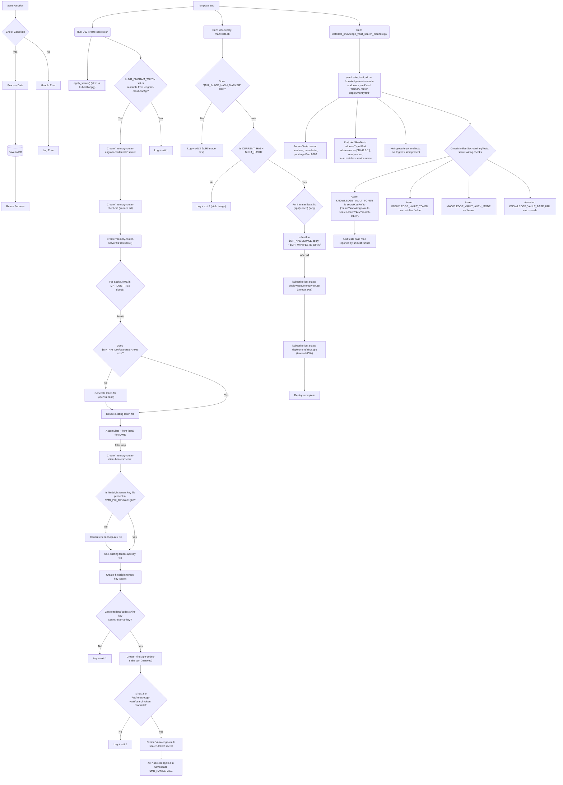

Proceeding with diagram generation...

# Generate Mermaid Diagram From Code

This command analyzes the coding files you have selected, understands each component, its flow, connections, and relationships, and then maps everything into a comprehensive Mermaid diagram.

Use this to quickly visualize the structure and logic of your code, making it easier to understand, document, and share.

---

📄 Analyzing: `kubernetes/mcps/bootstrap/03-create-secrets.sh, kubernetes/mcps/bootstrap/05-deploy-manifests.sh, tests/test_knowledge_vault_search_manifest.py`

📊 Generating: **Flowchart**

Fetching Mermaid documentation for flowchart.md
Completed with input: {
  "file": "flowchart.md"
}

Retrieved Mermaid flowchart syntax docs (flowchart.md) and used them as source of truth.

Open Diagram in Editor