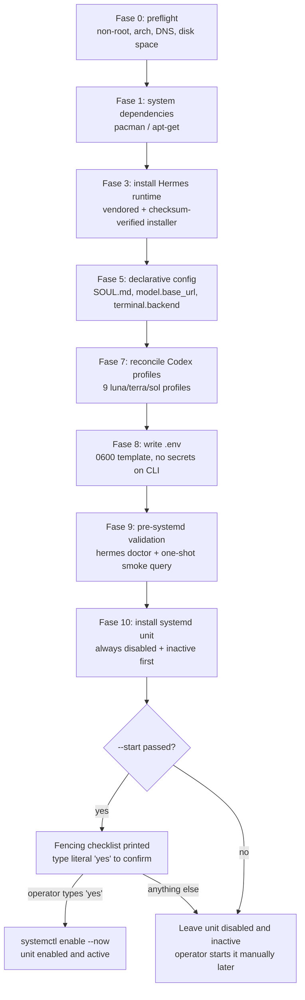

# Production runbook: installing a persistent Hermes gateway

Stand up Hermes as a persistent, auto-restarting host service (not a
Kubernetes pod — see [Two runtimes, one machine](../architecture/README.md#two-runtimes-one-machine)
if that split isn't clear yet) using
[`hermes-native/scripts/install-hermes.sh`](../../hermes-native/scripts/install-hermes.sh).

## What this script does and doesn't do

This implements the `role=primary`, `mode=bootstrap` path of the installer
contract defined in **specs/004_hermes_native_clone_systemd.md** — a
brand-new host, no existing state to restore. That's the actual scenario
that matters today: this project has one host (`trantor`), one primary, no
standby, no worker nodes.

**Deliberately not implemented** (the script fails closed and tells you why
if you ask for these, rather than faking support):

| Not implemented | Why | What to do instead |
|---|---|---|
| `mode=memory-seed` / `mode=primary-restore` | Restoring real state (SQLite, sessions, OAuth) from a backup archive is high-stakes and untested in script form | Follow spec 004's Fase 4 by hand |
| `role=standby` / `role=worker` | No second host exists yet to install onto | Follow spec 004's Fase 10 by hand when one does |
| Fase 6 (custom skill sync) | `hermes-native/skills/` doesn't exist in this repo yet (spec 004's own pending item) | Nothing to sync until that directory exists |
| Vendoring the official installer | Spec 004 requires a checksum-pinned local copy, not `curl \| bash` against a mutable upstream script; none is vendored yet | See [Before you run it](#before-you-run-it) below |

**What it does implement, faithfully:** preflight (non-root, arch, DNS,
LiteLLM reachability, disk space), system dependency install
(Arch/CachyOS and Debian/Ubuntu), the vendored+checksum-verified installer
invocation, declarative config apply (`SOUL.md`, `model.base_url`,
`terminal.backend`), **reconciling all nine Codex profiles** from
`kubernetes/hermes/profiles/profiles.yaml` (real file, real structure —
`luna-{low,medium,high}`, `terra-{low,medium,high}`, `sol-{low,medium,high}`),
`.env` creation with a `0600` template (never accepts secrets as CLI
arguments — spec 004 rule 7), `hermes doctor` + one-shot validation, and
systemd install that **always leaves the unit disabled and inactive** unless
you pass `--start` *and* type the literal word `yes` at an interactive
fencing checklist.

## Install flow (Fase 0–10, as implemented)

The script's phase numbering skips Fase 2, 4, and 6 on purpose: Fase 2
(distro-specific package selection) is folded into Fase 1, Fase 4
(restore modes) and Fase 6 (custom skill sync) are the "not implemented"
items in the table above — the script jumps straight from the phase before
each gap to the next implemented one.



| Fase | What it does | Exact file(s) read/written |
|---|---|---|
| 0 | Preflight: rejects root, validates `uname -m`, resolves `github.com` via DNS, probes `${HERMES_LITELLM_URL%/v1}/health/readiness`, checks free space in `$SERVICE_HOME` | none (read-only checks) |
| 1 | Installs system dependencies via `pacman` (Arch/CachyOS) or `apt-get` (Debian/Ubuntu): `ca-certificates curl git jq unzip sqlite(3) ffmpeg ripgrep` | none |
| 3 | Verifies checksum and runs the vendored official installer | `hermes-native/vendor/install-hermes.sh`, `hermes-native/vendor/install-hermes.sh.sha256` (reads); installs into `$HERMES_HOME` |
| 5 | Backs up existing `config.yaml`, copies `SOUL.md`, sets `model.base_url` and `terminal.backend` | reads `kubernetes/hermes/config/SOUL.md`; writes `$HERMES_HOME/SOUL.md`, `$HERMES_HOME/config.yaml`, backs up to `$HERMES_HOME/backups-before-install/config.yaml.<timestamp>` |
| 7 | Reconciles all nine Codex profiles (creates missing ones, sets `model.provider`, `model.base_url`, `model.default`, `terminal.backend`, `agent.reasoning_effort` per profile) | reads `kubernetes/hermes/profiles/profiles.yaml`; writes each `$HERMES_HOME/profiles/<name>/config.yaml` |
| 8 | Creates `.env` with a `0600` commented-out template if absent, or re-applies `0600` permissions if it already exists | writes `$HERMES_HOME/.env` |
| 9 | Runs `hermes doctor`, reads back `model.base_url`/`terminal.backend`, and a one-shot smoke query | reads `$HERMES_HOME/config.yaml` (via `hermes config get`) |
| 10 | Installs the systemd unit via `hermes gateway install --system --no-start-now --no-start-on-login`, force-disables/stops it, then branches on `--start` | no config files; touches the systemd unit only |

## Before you run it

The vendored official installer isn't in this repo yet
(`hermes-native/vendor/install-hermes.sh` — spec 004's own "trabajo
pendiente" item 5). The script will tell you exactly this and exit `20` if
it's missing. To provide it:

```bash
# Get the real installer from the Hermes project's own install instructions,
# save it here, then pin its checksum:
sha256sum hermes-native/vendor/install-hermes.sh > hermes-native/vendor/install-hermes.sh.sha256
```

Never `curl | bash` it directly — the whole point of vendoring is that a
pinned `--commit` on an unpinned installer script still lets upstream
change what runs *before* your commit is even checked out.

## Running it

```bash
hermes-native/scripts/install-hermes.sh \
  --litellm-url http://192.168.1.241:4000/v1 \
  --allow-insecure-http
```

(`--allow-insecure-http` is needed today because LiteLLM is plain HTTP on
the LAN — see spec 004's security criteria for why this is flagged, not
silently accepted, and what "properly" looks like: HTTPS, or a
per-host-revocable key instead of the shared master key.)

Add `--enable-browser` only if you actually need Playwright/Chromium (skips
by default — most servers don't need it). Add `--start` only when you're
ready to go through the fencing checklist and actually flip this host live.

## After it finishes

The unit is installed, disabled, and inactive — nothing is running yet.
Confirm:

```bash
systemctl list-unit-files 'hermes*' --no-pager
HERMES_HOME=~/.hermes hermes gateway status
HERMES_HOME=~/.hermes hermes profile list
```

Fill in the real secrets in `~/.hermes/.env` (the script wrote a `0600`
template with every key commented out) — at minimum `OPENAI_API_KEY` and,
for a primary, `TELEGRAM_BOT_TOKEN` + `TELEGRAM_ALLOWED_USERS`.

Then, only once you've confirmed no other gateway anywhere holds the same
Telegram token:

```bash
hermes-native/scripts/install-hermes.sh \
  --litellm-url http://192.168.1.241:4000/v1 \
  --allow-insecure-http \
  --start
# type "yes" at the fencing prompt
```

Full functional validation checklist (Telegram ping, a real Qwen query, a
Codex profile query, a non-destructive terminal command, a service restart,
a host reboot test) is in **specs/004, "Fase 11 - Validacion funcional"** —
run through it before considering the install done.

## Installing Hermes on a Raspberry Pi worker (planned, not yet implemented)

> **This is not a working procedure today.** Three facts, plainly:
> 1. No Raspberry Pi exists in this project's real infrastructure — only
>    `trantor` runs anything right now.
> 2. `install-hermes.sh` explicitly does **not** implement `role=worker`
>    yet — see the "Deliberately not implemented" table above
>    (`role=standby` / `role=worker`: "No second host exists yet to install
>    onto").
> 3. The diagram below synthesizes the *intended* worker flow from
>    **specs/004_hermes_native_clone_systemd.md**'s worker-role text, so
>    there's something concrete to build against once real Raspberry Pi
>    hardware exists — it is a target design, not a script that runs.

```mermaid
graph TD
    ARCH["Detect arm64, refuse amd64 artifacts<br/>(spec 004 'Particularidades de Raspberry Pi' #2)"]
    OS["Raspberry Pi OS Lite 64-bit or Debian ARM64<br/>(spec 004 'Particularidades de Raspberry Pi' #1)"]
    MODE["--mode bootstrap (or memory-seed)<br/>never primary-restore unless formally promoted<br/>(spec 004 'Particularidades de Raspberry Pi' #4)"]
    NOBROWSER["Install with --skip-browser initially<br/>(spec 004 'Particularidades de Raspberry Pi' #3)"]
    CONFIG["Apply config.yaml, SOUL.md, profiles.yaml<br/>from the declarative source<br/>(spec 004 acceptance criteria, 'En Raspberry Pi worker')"]
    LANURL["model.base_url = LAN IP/DNS of LiteLLM,<br/>never Kubernetes cluster DNS<br/>(spec 004 'Particularidades de Raspberry Pi' #5)"]
    LOCALBACKEND["terminal.backend: local<br/>commands run on the RPi itself, not trantor<br/>(spec 004 'Particularidades de Raspberry Pi' #6)"]
    NOTOKEN["No Telegram token, no TELEGRAM_ALLOWED_USERS<br/>worker never receives the primary bot token<br/>(spec 004 role table, .env policy: worker column)"]
    NOAUTH["No auth.json copied from primary by default<br/>Codex profiles stay 'unauthenticated' unless<br/>explicitly authenticated on this host<br/>(spec 004 Fase 7 discussion + 'Particularidades' #8)"]
    NOGATEWAY["Worker sin mensajeria ni cron:<br/>do NOT install gateway / systemd unit<br/>Hermes reachable via CLI/SSH only<br/>(spec 004 Fase 10, 'Worker sin mensajeria ni cron')"]
    VALIDATE["Validate: gateway status shows no unit,<br/>hermes doctor OK, CLI reaches LiteLLM<br/>(spec 004 Fase 11, worker validation)"]

    ARCH --> OS --> MODE --> NOBROWSER --> CONFIG --> LANURL --> LOCALBACKEND --> NOTOKEN --> NOAUTH --> NOGATEWAY --> VALIDATE

    click ARCH "../../specs/004_hermes_native_clone_systemd.md" "Particularidades de Raspberry Pi, item 2"
    click OS "../../specs/004_hermes_native_clone_systemd.md" "Particularidades de Raspberry Pi, item 1"
    click MODE "../../specs/004_hermes_native_clone_systemd.md" "Particularidades de Raspberry Pi, item 4"
    click NOBROWSER "../../specs/004_hermes_native_clone_systemd.md" "Particularidades de Raspberry Pi, item 3"
    click CONFIG "../../specs/004_hermes_native_clone_systemd.md" "acceptance criteria, En Raspberry Pi worker"
    click LANURL "../../specs/004_hermes_native_clone_systemd.md" "Particularidades de Raspberry Pi, item 5"
    click LOCALBACKEND "../../specs/004_hermes_native_clone_systemd.md" "Particularidades de Raspberry Pi, item 6"
    click NOTOKEN "../../specs/004_hermes_native_clone_systemd.md" "Fase 8 role policy table"
    click NOAUTH "../../specs/004_hermes_native_clone_systemd.md" "Fase 7 discussion + Particularidades item 8"
    click NOGATEWAY "../../specs/004_hermes_native_clone_systemd.md" "Fase 10, Worker sin mensajeria ni cron"
    click VALIDATE "../../specs/004_hermes_native_clone_systemd.md" "Fase 11, worker validation"
```



| Diagram node | Intended behavior | Spec 004 citation |
|---|---|---|
| Detect arm64 | Installer must detect `arm64` and never restore/copy `amd64` runtime, venv, caches, or binaries | "Particularidades de Raspberry Pi", item 2; acceptance criteria "En Raspberry Pi worker" |
| OS | Raspberry Pi OS Lite 64-bit or Debian ARM64 | "Particularidades de Raspberry Pi", item 1 |
| Mode | `bootstrap` or `memory-seed` only; `primary-restore` forbidden unless the RPi is formally promoted to sole primary | "Particularidades de Raspberry Pi", item 4 |
| No browser | Install with `--skip-browser` initially | "Particularidades de Raspberry Pi", item 3 |
| Declarative config | Config, SOUL, custom skills, and profiles must match the declarative source | Acceptance criteria, "En Raspberry Pi worker" |
| LAN URL | `model.base_url` set to the LAN IP/DNS of LiteLLM, never `*.svc.cluster.local` | "Particularidades de Raspberry Pi", item 5; also "LiteLLM permanece centralizado" |
| Local backend | `terminal.backend: local` — commands execute on the RPi, not `trantor` | "Particularidades de Raspberry Pi", item 6 |
| No token | Worker never receives the primary Telegram bot token or `TELEGRAM_ALLOWED_USERS`; a worker `.env` containing the primary token must be rejected | Fase 8 role policy table; "Un solo gateway por identidad de mensajeria" |
| No auth copy | `auth.json` is not copied automatically from the primary; Codex profiles install as `unauthenticated` on an unauthenticated worker, and inference must fail closed with a login instruction | Fase 7 discussion ("En un worker deliberadamente no autenticado…"); "Particularidades de Raspberry Pi", item 8 |
| No gateway | "Worker sin mensajeria ni cron" — do not install the gateway/systemd unit at all; Hermes stays reachable by CLI, SSH, or scripts | Fase 10, "Worker sin mensajeria ni cron" subsection |
| Validation | Confirm no systemd unit exists for Hermes and that the CLI can reach LiteLLM | Fase 11, "En worker se valida que no exista unidad y que el CLI pueda consultar LiteLLM" |

## See also

- `specs/004_hermes_native_clone_systemd.md` — the full installer contract
  this script implements a scoped slice of, including the parts it doesn't
  (restore modes, standby/worker roles, promotion procedure, rollback to
  Kubernetes)
- [Architecture overview](../architecture/README.md#hermes-gateway-host)
- [Kubernetes cluster bootstrap](kubernetes-bootstrap.md) — the companion
  runbook for the other half of this project; Hermes needs a reachable
  LiteLLM before this script's preflight will pass
