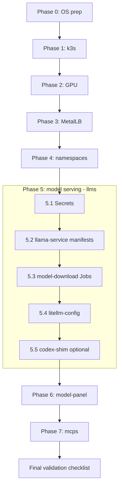
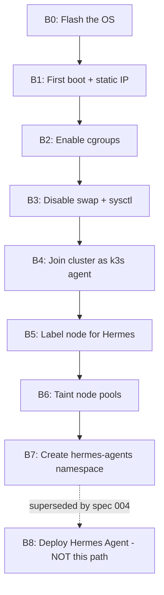

# Production runbook: bootstrapping the Kubernetes cluster from scratch

Stand up the whole k3s cluster and every workload on a fresh machine, in the
order that actually works — later steps depend on earlier ones (GPU before
model-serving, namespaces before secrets, LiteLLM before anything that
routes through it). This runbook sequences and cross-links the detailed
steps that already live in specs 001, 011, 012, 014 and each service's own
deep-dive under `docs/services/` — it does not repeat their content, it
orders it.

**Read [Architecture overview](../architecture/README.md) first** if you
haven't — this runbook assumes you know what each piece is.

## Quick path

1. [Phase 0 — OS prep](#phase-0--os-prep)
2. [Phase 1 — k3s](#phase-1--k3s)
3. [Phase 2 — GPU](#phase-2--gpu-nvidia-driver--device-plugin)
4. [Phase 3 — MetalLB](#phase-3--metallb)
5. [Phase 4 — namespaces](#phase-4--namespaces)
6. [Phase 5 — model serving (llms)](#phase-5--model-serving-llms)
7. [Phase 6 — model-panel](#phase-6--model-panel)
8. [Phase 7 — mcps (Engram, memory-router, brave-search)](#phase-7--mcps-engram-memory-router-brave-search)
9. [Final checklist](#final-validation-checklist)

### Full bootstrap flow



| Node | File(s) / command | Notes |
|------|--------------------|-------|
| Phase 0: OS prep | No repo file — inline commands, `specs/001_k8s_llm_cluster.md, section A0` (and `A0-alt`, `Firewall en CachyOS/Arch`) | Must complete before k3s install |
| Phase 1: k3s | No repo file — inline `curl -sfL https://get.k3s.io \| sh -s -` shown above; full A1/A2 steps in `specs/001, sections A1–A2` | `--disable servicelb` is required |
| Phase 2: GPU | No repo file — inline commands, `specs/001, section A5` | Verify `nvidia.com/gpu: 1` before continuing |
| Phase 3: MetalLB | No repo file — upstream manifest URL `https://raw.githubusercontent.com/metallb/metallb/v0.14.8/config/manifests/metallb-native.yaml`; `IPAddressPool`/`L2Advertisement` YAML in `specs/001, section A6` | Production range `192.168.1.240-192.168.1.250` |
| Phase 4: namespaces | No repo file — inline `kubectl create namespace llms` / `mcps` shown above | `mcps` is the real namespace for Engram/memory-router/brave-search |
| 5.1 Secrets | `llms/litellm-auth`, `llms/codex-shim-auth`, `llms/codex-shim-key` (applied via `kubectl`, see [docs/services/llama-service.md](../services/llama-service.md)) | codex-shim secrets only needed for Cloud mode |
| 5.2 llama-service manifests | `kubernetes/llama-service/` (PVCs, Deployments at `replicas: 0` except `llama-router`, router ConfigMap) | See "Deploying from scratch" in llama-service.md |
| 5.3 model-download Jobs | `kubernetes/llama-service/` model-download Jobs (see llama-service.md) | At minimum the **daily** model |
| 5.4 litellm-config | `kubernetes/proxy/litellm-config.yaml` | Single routing layer for the whole cluster + Hermes |
| 5.5 codex-shim (optional) | `kubernetes/codex-shim/` | Only for Cloud mode |
| Phase 6: model-panel | Secret, image build/import, exporter DaemonSets, panel Deployment — see [docs/services/model-panel.md § Deploying](../services/model-panel.md#deploying) | Depends on Phase 5 being live |
| Phase 7: mcps | `docs/engram-cloud/installation.md` (Engram Cloud, live); [docs/services/memory-router.md § Deploying](../services/memory-router.md#deploying) (not yet deployed); `kubernetes/mcps/brave-mcp-activation-guide.md` (brave-search-mcp) | See phase text above for what's actually live vs. planned |
| Final validation checklist | No repo file — inline `kubectl`/`curl` commands under [Final validation checklist](#final-validation-checklist) | Run after Phase 7 |

## Assumptions

- **Single node.** This runbook targets what's actually running today: one
  machine (`trantor`) as both control-plane and the only worker. Spec
  **001** originally planned Raspberry Pi worker nodes in a separate
  `hermes-agents` namespace — that never materialized; Hermes moved to a
  native host install instead (spec **004**). If you're adding real worker
  nodes later, spec 001's Part B (RPi join) still applies, but nothing in
  this repo currently depends on it.
- Linux host, NVIDIA GPU, on a LAN you control the IP range for.
- You're comfortable running commands as your own user with `sudo` for
  system-level steps — nothing here should run entirely as root.

## Phase 0 — OS prep

Full commands (netplan/NetworkManager static IP, swap off, kernel modules,
sysctl, firewall — separate blocks for Debian/Ubuntu vs. Arch/CachyOS) are
in **specs/001_k8s_llm_cluster.md, section A0**. Do all of it before
installing k3s — swap must be off and the sysctl/module settings must be in
place first, or kubelet won't start cleanly.

If you're on CachyOS/Arch like `trantor`, use the `#### A0-alt` and
`#### Firewall en CachyOS/Arch` subsections specifically — the nftables
policy-drop ruleset there is the one actually in production, not a
theoretical alternative.

## Phase 1 — k3s

```bash
curl -sfL https://get.k3s.io | sh -s - \
  --write-kubeconfig-mode 644 \
  --disable servicelb \
  --node-name pc-master
```

`--disable servicelb` is required — MetalLB (Phase 3) replaces it and the
two conflict if both run. Full A1/A2 steps (including the `fish`-shell
`KUBECONFIG` variant, since `trantor`'s shell is fish, not bash) are in
**specs/001, sections A1–A2**.

**Known failure mode, already hit in production on this exact host** (dual
dynamic IPv6 via Wi-Fi SLAAC confusing the node-registration controller,
then a CNI-path mismatch after installing the NVIDIA container toolkit) —
see **specs/001, the "Troubleshooting: el nodo queda NotReady..." block
under A5** for both symptoms and their exact fixes before you assume
something else is wrong. If your node cycles `Ready`↔`NotReady` every ~15
minutes, that's the first thing to check, not a networking mystery to
re-diagnose from scratch.

## Phase 2 — GPU (NVIDIA driver + device plugin)

Full commands (driver install, `nvidia-ctk runtime configure`, device
plugin DaemonSet, verification) are in **specs/001, section A5** — including
a CachyOS-specific driver variant (`nvidia-open`) and three more
already-diagnosed failure modes for this exact host (CNI config template
overwritten by the toolkit's pacman hook; device plugin needing an explicit
`RuntimeClass` because `runc` is still the default runtime even after
`nvidia-ctk` configures containerd). Read that whole A5 troubleshooting
block before improvising — all three symptoms there were real production
incidents on `trantor`, not hypotheticals.

Verify before continuing:

```bash
kubectl describe node trantor | grep -A5 Allocatable
# must show: nvidia.com/gpu: 1
```

Everything downstream (vLLM, llama.cpp variants, `nvidia-gpu-exporter`)
depends on this being correct — don't proceed until it is.

## Phase 3 — MetalLB

```bash
kubectl apply -f https://raw.githubusercontent.com/metallb/metallb/v0.14.8/config/manifests/metallb-native.yaml
kubectl -n metallb-system rollout status deployment/controller
```

Then apply an `IPAddressPool` + `L2Advertisement` for a LAN range you own
(not your router's DHCP range) — exact YAML in **specs/001, section A6**.
Production uses `192.168.1.240-192.168.1.250`; LiteLLM gets `.241`, Traefik
gets `.240` (Traefik's LoadBalancer IP comes bundled with k3s — you don't
apply it separately, but it draws from this same MetalLB pool once it
exists).

## Phase 4 — namespaces

```bash
kubectl create namespace llms
kubectl create namespace mcps
```

`mcps` is what Engram, memory-router, and brave-search-mcp all actually
live in — see [Known drift and gotchas](../architecture/README.md#known-drift-and-gotchas)
for why `kubernetes/engram/namespace.yaml` says `mcps` and not `engram`
(fixed in PR #16; if you're on an older checkout, the namespace name in
that file is what to trust, not the directory name).

## Phase 5 — model serving (`llms`)

This is the biggest phase. Full detail (secrets, ordering, exact
`kubectl apply` sequence, model-download jobs, LiteLLM alias table,
`codex-shim` bootstrap) is in
**[docs/services/llama-service.md](../services/llama-service.md)** —
follow its "Deploying from scratch" section directly rather than
duplicating it here. In short, the order matters:

1. Secrets first (`llms/litellm-auth`, and `llms/codex-shim-auth` +
   `llms/codex-shim-key` if you want Cloud mode at all).
2. `kubernetes/llama-service/` manifests (PVCs, Deployments at `replicas: 0`
   except `llama-router`, the router ConfigMap).
3. The model-download Jobs you actually need — at minimum the **daily**
   model, since `llama-router` can't come up without it.
4. `kubernetes/proxy/litellm-config.yaml` — the single routing layer
   everything else in the cluster and Hermes itself will call through.
5. `kubernetes/codex-shim/` — only needed if you want Cloud mode
   (model-panel's toggle, or LiteLLM's `cloud` alias) to work at all.

Verify with the exact `curl .../v1/models` command in that doc before
moving on — nothing past this point works if LiteLLM isn't answering.

## Phase 6 — model-panel

Once Phase 5 is live, model-panel's GPU-handoff toggle and metrics gauges
have something real to control and measure. Full sequence — secret, image
build/import, both exporter DaemonSets, the panel Deployment itself — is in
**[docs/services/model-panel.md § Deploying](../services/model-panel.md#deploying)**.

## Phase 7 — `mcps` (Engram, memory-router, brave-search)

**Engram Cloud** is the one piece here that's actually live in production —
full install (CA/certs, secrets, manifests, verification) is in
**`docs/engram-cloud/installation.md`**.

**memory-router** is code-complete and tested but **not yet deployed**
anywhere, including in this runbook's own reference production. Its
"Deploying" section
([docs/services/memory-router.md § Deploying](../services/memory-router.md#deploying))
documents the intended sequence and flags exactly what's still missing
(an unbuilt image, a placeholder ingress hostname) — read it before
attempting this in a new environment; don't assume it's a copy-paste-ready
step the way the others are.

**brave-search-mcp** — see `kubernetes/mcps/brave-mcp-activation-guide.md`
for its own short activation steps (mainly: a `BRAVE_API_KEY` secret).

## Adding a Raspberry Pi worker node (planned, not yet run against real hardware)

> **This procedure has never been executed against real Raspberry Pi
> hardware.** It is documented in `specs/001_k8s_llm_cluster.md, Part B`
> ("Configurar las Raspberry Pi como nodos worker"), but there is no RPi in
> the current live cluster — `kubectl get nodes` shows only `trantor` (see
> [Assumptions](#assumptions) above). This was the **original** plan from
> spec 001. Spec **004** later moved Hermes off Kubernetes entirely, onto
> host-level systemd for the primary node (see
> [Installing Hermes gateway on the host](hermes-gateway-install.md) for what
> actually runs today). That means step **B8** below ("Desplegar Hermes
> Agent en las RPi" as a Kubernetes `Deployment`) is superseded architecture,
> even in spec 001's own original terms. A real RPi joining the cluster
> today would still follow **B0–B7** for the k3s join — that part is
> architecturally unchanged and untested, not obsolete — but Hermes running
> on it would need to use spec 004's native systemd installer approach
> instead of B8's Deployment. That path isn't built yet either:
> `install-hermes.sh`'s `role=worker` mode is listed as **NOT IMPLEMENTED**
> in
> [docs/production/hermes-gateway-install.md](hermes-gateway-install.md)'s
> "NOT IMPLEMENTED" table — it says to follow spec 004's Fase 10 by hand
> until a second host exists.



| Node | Spec 001 section | Notes |
|------|-------------------|-------|
| B0: Flash the OS | `specs/001_k8s_llm_cluster.md, section B0` | Raspberry Pi OS Lite (64-bit), hostname/SSH via Imager |
| B1: First boot + static IP | `specs/001, section B1` | Edits `/etc/dhcpcd.conf` |
| B2: Enable cgroups | `specs/001, section B2` | Edits `/boot/firmware/cmdline.txt`, then reboot |
| B3: Disable swap + sysctl | `specs/001, section B3` | Mirrors the PC's Phase 0 sysctl settings |
| B4: Join cluster as k3s agent | `specs/001, section B4` | Uses the URL/token saved in section A3; repeat B0–B4 per RPi |
| B5: Label node for Hermes | `specs/001, section B5` | `kubectl label node rpi-1 workload=agent` |
| B6: Taint node pools | `specs/001, section B6` | Optional but recommended; keeps vLLM off RPi and Hermes off `pc-master` |
| B7: Create hermes-agents namespace | `specs/001, section B7` | `kubectl create namespace hermes-agents` |
| B8: Deploy Hermes Agent (NOT this path) | `specs/001, section B8` | Superseded by spec 004's host systemd install; `role=worker` not yet implemented in `install-hermes.sh` — see callout above |

## Final validation checklist

```bash
kubectl get nodes -o wide                        # trantor, Ready
kubectl describe node trantor | grep -A5 Allocatable   # nvidia.com/gpu: 1
kubectl get pods -n llms -o wide                  # litellm, llama-router Running; others per what you started
kubectl get pods -n mcps -o wide                  # engram-cloud, engram-postgres Running
kubectl get svc -n llms litellm                   # EXTERNAL-IP assigned, not <pending>
curl http://192.168.1.241:4000/v1/models \
  -H "Authorization: Bearer $LITELLM_MASTER_KEY"  # lists your configured aliases
kubectl get pods -n llms -l app=model-panel       # Running, 1/1
```

If every one of those is true, the cluster is production-ready for
[Hermes to be pointed at it](hermes-gateway-install.md) — that's a
separate, host-level installation, not part of this cluster bootstrap.

## See also

- [Architecture overview](../architecture/README.md)
- [Glossary](../glossary.md)
- `specs/001_k8s_llm_cluster.md` — the founding spec this phase-by-phase
  order is extracted from, including every troubleshooting block referenced
  above
- [docs/services/](../services/) — the five per-service deep dives this
  runbook cross-links into for Phases 5–7
- [Installing Hermes gateway on the host](hermes-gateway-install.md) — the
  companion runbook for the non-Kubernetes half of this project
