# hermes-intent-orchestration

A Hermes plugin that classifies every user turn locally and routes bounded
tasks to isolated Luna, Terra, or Sol profiles — without switching Hermes's
primary profile, copying credentials, or touching Hermes core. It exists so
Jarvis can pick the right capability/cost/risk tier per request instead of
running everything through one fixed model. Spec **009**.

## Quick path

1. Install the package into **Hermes's own venv** (not a separate one):
   ```bash
   /home/pedro/.hermes/hermes-agent/venv/bin/pip install -e \
     /home/pedro/Documentos/Projects/jarvis_project/hermes-native/orchestration
   ```
2. Enable it in `~/.hermes/config.yaml`:
   ```yaml
   plugins:
     enabled:
       - intent-orchestration
     entries:
       intent-orchestration:
         mode: shadow
         semantic_classifier: true
         classifier_timeout_seconds: 15
         local_base_urls:
           - http://192.168.1.241:4000/v1
         worker_cwd: /home/pedro/Documentos/Projects
         audit_enabled: true
         allow_high_risk_auto: false
         allow_terminal_workers: false
         require_classifier_for_explicit: true
   ```
3. Restart: `sudo systemctl restart hermes-gateway.service`.
4. Verify: `hermes plugins list --plain --no-bundled` should list
   `intent-orchestration`.

Start in `shadow` mode — it classifies and audits every turn but never
changes what actually answers the user. Roll back at any time by removing
`intent-orchestration` from `plugins.enabled` and restarting; nothing else
needs to change.

## How classification works

Every turn produces a `Classification` (`hermes_intent_orchestration/policy.py`)
with these fields:

| Field | Values | Meaning |
|---|---|---|
| `task_class` | `chat`, `lookup`, `research`, `deep_research`, `coding`, `review`, `incident`, `local_large` | What kind of work this is |
| `complexity` | `low`, `medium`, `high` | Scope/depth of the task |
| `needs_current_data` | bool | Needs information past the model's training cutoff |
| `needs_tools` | subset of `web_search`, `web_extract`, `browser`, `files`, `terminal`, `tests`, `citations`, `deep_research` | Allowlisted capabilities only — never arbitrary commands |
| `privacy` | `local_only`, `cloud_allowed` | Whether the request may leave the host |
| `risk` | `low`, `medium`, `high` | Security/production/destructive-action risk |
| `route` | one of the 9 profiles, `local`, or `local_large` | Candidate route |
| `confidence` | 0.0–1.0 | How sure the classifier is |
| `reason` | ≤160 chars | Short audit justification, never chain-of-thought |

`Classification.from_mapping()` validates every field against a closed
allowlist (`TASK_CLASSES`, `LEVELS`, `PRIVACY_LEVELS`, `TOOLS`, and the
policy's own `allowed_routes`) and raises `ValueError` on anything else —
this is what stops a classifier response from inventing a route or tool
that was never allowlisted.

**There are two classification paths, always both computed:**

1. **`rule_classification(text)`** — deterministic, regex/keyword-based
   (`_has_any`, `_has_pattern` over NFKD-normalized, lowercased text). Always
   runs, is cheap, and is the fallback when the semantic classifier is
   unavailable.
2. **Semantic classifier** — a real LLM call, only attempted when
   `semantic_classifier: true` **and** `_classifier_is_local()` confirms the
   primary model's exact `base_url` is in `local_base_urls`
   (`runtime.py::_semantic_classification`). It sends `classifier-prompt.md`
   as the system message and `classifier-schema.json` + the user text as the
   user message, `temperature: 0`, `response_format: json_object`,
   `chat_template_kwargs: {enable_thinking: false}`, with a hard
   `classifier_timeout_seconds` (default 15) via raw `http.client` — this
   deliberately bypasses Hermes's own model fallback chain. On any failure
   (timeout, bad JSON, invalid fields) it falls back silently to the rule
   classification and marks `classifier_unavailable = True`.

If both ran, `RouterPolicy._merge_semantic()` combines them: `task_class`
comes from semantic (unless it claims `local_large` without the user
explicitly asking for it — then it's discarded back to the rule result),
`complexity`/`risk` take the **higher** of the two, `privacy` is
`local_only` if *either* side said so, and `needs_tools` is the union
(cleared entirely if the user said "no tools").

**The four modes** (`mode` config key, least to most autonomous):

| Mode | Behavior |
|---|---|
| `disabled` | No classification, no audit, plugin is a no-op |
| `shadow` | Classifies and audits every turn; primary always answers (recommended default) |
| `explicit` | Delegates only when the user names an allowlisted profile by name |
| `auto` | Policy-driven; delegates automatically whenever the decision says so, subject to the safety gates below |

## How routing works

The diagram below traces one turn end to end: classification in
`pre_llm_call`, `RouterPolicy.decide()`'s precedence chain, the two extra
safety gates applied afterward, and how `llm_execution` turns the resulting
`Decision` into an actual response.

```mermaid
graph TD
    subgraph S1["pre_llm_call — classify & decide"]
        A["User turn"] --> B{"mode == disabled?"}
        B -- yes --> B1["no-op, return"]
        B -- no --> C["rule_classification() always runs +\nsemantic_classification() if enabled\n(single call to local_base_urls, hard 15s timeout)"]
        C --> D["Classification\n(task_class, complexity, risk, privacy)"]
        D --> E["RouterPolicy.decide()"]
        E --> F{"privacy == local_only?"}
        F -- "yes — outranks every other rule,\nnot even explicit sol-high overrides it" --> F1["final = local / local_large\nrule = privacy_local_only"]
        F -- no --> G["explicit_profile -> explicit_local_large ->\nconfidence >= apply (0.80) -> >= economical (0.55)\n-> low_confidence_fallback"]
        G --> P["proposed_route -> final_route\n(Decision, should_delegate)"]
        F1 --> P
        P --> Q{"classifier_unavailable AND explicit_override AND\nmode in explicit,auto AND\nrequire_classifier_for_explicit?"}
        Q -- yes --> Q1["rule = explicit_classifier_unavailable\nshould_delegate = False"]
        Q -- no --> R{"should_delegate AND\n(final_route == sol-high OR risk == high) AND\nNOT allow_high_risk_auto AND NOT explicit_override?"}
        R -- yes --> R1["rule = confirmation_required\nshould_delegate = False"]
    end

    Q1 --> X["Decision handed to llm_execution"]
    R1 --> X
    R -- no --> X
    X --> Y{"classification.privacy == local_only?"}
    Y -- yes --> Y1["direct local completion\nstatus = privacy_local\n(privacy_local_failed on error)"]
    Y -- no --> Z{"final_route == local_large AND\nmode != shadow?"}
    Z -- yes --> Z1["synthetic response\nstatus = local_large_unavailable"]
    Z -- no --> AA{"rule == explicit_classifier_unavailable?"}
    AA -- yes --> AA1["synthetic response\nstatus = explicit_blocked"]
    AA -- no --> BB{"should_delegate?"}
    BB -- yes --> CC["delegated worker subprocess\non the routed Luna/Terra/Sol profile\nstatus = delegated"]
    BB -- no --> DD["primary model answers normally\nstatus = local\n(covers confirmation_required and\nlow_confidence_fallback alike)"]

    click A "../../hermes-native/orchestration/src/hermes_intent_orchestration/runtime.py" "pre_llm_call"
    click B "../../hermes-native/orchestration/src/hermes_intent_orchestration/runtime.py" "pre_llm_call - mode check"
    click B1 "../../hermes-native/orchestration/src/hermes_intent_orchestration/runtime.py" "pre_llm_call - mode disabled"
    click C "../../hermes-native/orchestration/src/hermes_intent_orchestration/runtime.py" "rule/semantic classification"
    click D "../../hermes-native/orchestration/src/hermes_intent_orchestration/policy.py" "Classification dataclass"
    click E "../../hermes-native/orchestration/src/hermes_intent_orchestration/policy.py" "RouterPolicy.decide"
    click F "../../hermes-native/orchestration/src/hermes_intent_orchestration/policy.py" "privacy == local_only check"
    click F1 "../../hermes-native/orchestration/src/hermes_intent_orchestration/policy.py" "privacy_local_only rule"
    click G "../../hermes-native/orchestration/src/hermes_intent_orchestration/policy.py" "precedence chain"
    click P "../../hermes-native/orchestration/src/hermes_intent_orchestration/policy.py" "Decision"
    click Q "../../hermes-native/orchestration/src/hermes_intent_orchestration/runtime.py" "pre_llm_call - explicit_classifier_unavailable gate"
    click Q1 "../../hermes-native/orchestration/src/hermes_intent_orchestration/runtime.py" "explicit_classifier_unavailable"
    click R "../../hermes-native/orchestration/src/hermes_intent_orchestration/runtime.py" "pre_llm_call - confirmation_required gate"
    click R1 "../../hermes-native/orchestration/src/hermes_intent_orchestration/runtime.py" "confirmation_required"
    click X "../../hermes-native/orchestration/src/hermes_intent_orchestration/runtime.py" "llm_execution"
    click Y "../../hermes-native/orchestration/src/hermes_intent_orchestration/runtime.py" "llm_execution - privacy check"
    click Y1 "../../hermes-native/orchestration/src/hermes_intent_orchestration/runtime.py" "privacy_local / privacy_local_failed"
    click Z "../../hermes-native/orchestration/src/hermes_intent_orchestration/runtime.py" "llm_execution - local_large check"
    click Z1 "../../hermes-native/orchestration/src/hermes_intent_orchestration/runtime.py" "local_large_unavailable"
    click AA "../../hermes-native/orchestration/src/hermes_intent_orchestration/runtime.py" "llm_execution - classifier_unavailable check"
    click AA1 "../../hermes-native/orchestration/src/hermes_intent_orchestration/runtime.py" "explicit_blocked"
    click BB "../../hermes-native/orchestration/src/hermes_intent_orchestration/runtime.py" "llm_execution - should_delegate check"
    click CC "../../hermes-native/orchestration/src/hermes_intent_orchestration/runtime.py" "delegated worker subprocess"
    click DD "../../hermes-native/orchestration/src/hermes_intent_orchestration/runtime.py" "primary model answers"
```



`confirmation_required` blocks delegation but is not a synthetic
"unavailable" message like the other two fail-closed paths — it just falls
through to the primary model the same way a low-confidence decision would;
only the audited `rule` column tells them apart. See the precedence list
below for the full detail behind the compressed `explicit_profile -> ...`
box above.

`RouterPolicy.decide(text, semantic, mode)` produces a `Decision`
(`proposed_route` → `final_route`, plus `rule` naming which branch fired).
Precedence, first match wins:

1. **Privacy** — if `signals.local_only` or `classification.privacy ==
   "local_only"`, force `final = "local"` (or `"local_large"` if the user
   explicitly asked for that model), `rule = "privacy_local_only"`. This is
   the one rule nothing else can override — not even an explicit `sol-high`
   mention (see `test_privacy_overrides_explicit_cloud_profile`).
2. **Explicit profile override** — the user named a profile
   (`usa sol-high`, `route to terra-medium`, `with luna-low`, `sol-high:` …
   — matched by `RouterPolicy.signals()`'s alias regex, spaces and dashes
   both work). `rule = "explicit_profile"`.
3. **Explicit `local_large`** — user asked for "local 27b" / "qwen 27b" by
   name. `rule = "explicit_local_large"`.
4. **High confidence** (`classification.confidence >= confidence.apply`,
   default `0.80`) — apply the classifier's proposed route as-is.
5. **Economical band** (`>= confidence.economical`, default `0.55`) — apply
   the **cheaper** route from `policy.yaml`'s `economical_routes` map
   (e.g. `sol-high` downgrades to `terra-high`, `terra-medium` downgrades to
   `luna-high`) instead of the proposed one.
6. **Low confidence fallback** — `final = "local"`, nothing gets delegated.

After that: if `final` isn't in `allowed_routes` (profiles from
`policy.yaml` + `{local, local_large}`), it's forced back to `local`
(`invalid_route_fallback`). `should_delegate` is only `True` when `final` is
an actual profile **and** (`mode == "auto"` or `mode == "explicit" and
explicit_override`) — in `shadow` or `disabled`, delegation is always
`False` regardless of what the route says.

**Two more safety gates live in `runtime.py::pre_llm_call`, after
`policy.decide()` returns, and can downgrade a decision the policy already
made:**

- **`require_classifier_for_explicit`** (default `True`): if the semantic
  classifier was unavailable *and* the user explicitly named a profile in
  `explicit`/`auto` mode, the delegation is blocked (`rule =
  "explicit_classifier_unavailable"`) — an explicit override alone isn't
  trusted to also vouch for privacy without the classifier's input.
- **`allow_high_risk_auto`** (default `False`): any decision that would
  delegate to `sol-high` or that carries `risk == "high"` gets blocked
  (`rule = "confirmation_required"`) unless the user explicitly named that
  profile, or the flag is turned on.

**`local_large` fails closed unconditionally** outside `shadow` mode
(`runtime.py::llm_execution`) — even if the policy picks it, the response is
a synthetic "not available yet" message; enabling it for real requires the
exclusive Qwen 27B coordinator from spec 008, which doesn't exist yet.

A note mentioned nowhere else: `signals.explicit_profile` only matches a
narrow set of connector phrases (`usa`, `use`, `route to`, `ruta a`,
`responde con`, `with`, or a leading `profile:` prefix) — just saying
"compare luna-low and luna-high" does **not** count as an override
(`test_profile_mentions_are_not_overrides`). If a routing rule you expect
to fire doesn't, check whether the phrasing actually matches one of those
connectors.

## Configuration

All keys live under `plugins.entries.intent-orchestration` in
`~/.hermes/config.yaml`, read fresh on every turn via `_config()`
(`hermes_cli.config.load_config()` — no restart needed to pick up a config
edit, only to load/unload the plugin itself).

| Key | Default | Purpose |
|---|---|---|
| `mode` | `shadow` | `disabled` / `shadow` / `explicit` / `auto` |
| `platforms` | `["cli", "telegram"]` | Only classify turns from these platforms |
| `semantic_classifier` | `true` | Whether to attempt the LLM classifier at all |
| `classifier_timeout_seconds` | `15` | Hard timeout for the classifier HTTP call |
| `classifier_max_tokens` | `320` | `max_tokens` sent to the classifier |
| `local_base_urls` | — (required for semantic + `local_only` execution) | Exact `base_url`s trusted as "local"; classifier and privacy-pinned completions only run if the primary model's `base_url` is in this list |
| `local_request_timeout_seconds` | `180` | Timeout for a `local_only`-pinned completion |
| `worker_cwd` | `os.getcwd()` | `cwd` for delegated worker subprocesses |
| `worker_timeout_seconds` | policy's per-route `budgets[route].timeout_seconds`, else `300` | Overrides the policy budget's timeout |
| `audit_enabled` | `true` | Whether routing events are written to SQLite at all |
| `audit_db` | `~/.hermes/orchestration/events.sqlite3` | Override the audit DB path |
| `allow_high_risk_auto` | `false` | Let `auto` mode delegate high-risk/`sol-high` decisions without explicit user naming |
| `allow_terminal_workers` | `false` | Let workers that need `files`/`terminal`/`tests` actually run |
| `require_classifier_for_explicit` | `true` | Block explicit overrides when the classifier was unavailable |
| `policy_path` | packaged `policy.yaml` | Override which policy file to load |

`policy.yaml` itself (loaded by `RouterPolicy`, cached and reloaded only if
`policy_path` changes) additionally defines:

| Key | Purpose |
|---|---|
| `profiles` | The list of allowlisted delegate profiles (the 9 Luna/Terra/Sol tiers) |
| `confidence.apply` / `confidence.economical` | The two confidence thresholds described above |
| `routes` | `task_class × complexity → route` table |
| `economical_routes` | Cheaper fallback route per expensive route |
| `budgets` | Per-route `timeout_seconds` / `max_sources` |

## The worker/sandbox model

A delegated task runs as a real subprocess, not an in-process call:

```
hermes -p <route> --cli --toolsets <toolsets> --ignore-rules chat -q <packet> -Q --source orchestration
```

(`runtime.py::_run_worker`). What it gets and doesn't get:

- **Environment**: only `HOME`, `USER`, `LOGNAME`, `PATH`, `LANG`, `LC_ALL`,
  `TZ`, `SSL_CERT_FILE`, `SSL_CERT_DIR` are inherited; `HERMES_TUI` is
  explicitly stripped; `HERMES_ORCHESTRATION_DEPTH=1` is set so a worker that
  itself tries to delegate is a no-op (`pre_llm_call` bails out immediately
  when that env var is set — this is what stops recursive delegation).
- **Toolset**, not raw tools: `_toolsets_for()` maps the classifier's
  `needs_tools` down to Hermes toolset names (`web`, `browser`, `terminal`,
  or `context_engine` if nothing else applies) — the worker never sees an
  arbitrary tool list.
- **Task packet, not conversation history**: the worker's entire input is
  `_task_packet()` — objective text, `task_class`, `complexity`, `risk`,
  `privacy`, allowed capabilities, citation requirement, time/source
  budgets, and completion criteria. No memory, no prior turns, no
  `auth.json`, no secrets from the primary session.
- **Fails closed for terminal/file/test capabilities**: if `needs_tools`
  includes `files`, `terminal`, or `tests` and `allow_terminal_workers` is
  not `true`, `_run_worker` raises `PermissionError` before ever spawning
  the process — because the installed profiles currently share the
  host-local terminal backend, not a verified container sandbox.
- **Concurrency limits**: a global `BoundedSemaphore(2)` caps concurrent
  workers, plus a dedicated `BoundedSemaphore(1)` for any `sol-*` route —
  acquiring either non-blocking; a busy slot raises immediately rather than
  queuing.
- **Process group kill on timeout/cancel**: `start_new_session=True` +
  `os.killpg` (SIGTERM, then SIGKILL after a 5s grace period) — a worker
  can't outlive its parent's timeout.
- A worker failure that came from an **explicit** user override returns a
  "not available" synthetic message rather than silently falling back to
  the primary model (so the user isn't surprised by an answer from a
  different profile than the one they asked for); a non-explicit failure
  falls back to letting the primary handle the turn normally.

## Audit logging

Every classified turn is written to SQLite at
`~/.hermes/orchestration/events.sqlite3` (override with `audit_db`), table
`routing_events`:

```
id, created_at, session_id, task_id, turn_id, platform, mode, status,
task_class, complexity, risk, privacy, proposed_route, final_route,
confidence, rule, explicit_override, error_type
```

Deliberately **never logged**: prompt text, model response content, tool
output, or secrets — `test_audit_schema_never_stores_prompt_content`
enforces this at the test level. `status` values you'll see include
`classified`, `classifier_unavailable`, `local`, `privacy_local`,
`privacy_local_failed`, `delegated`, `worker_failed`, `local_large_unavailable`,
`explicit_blocked`, `state_overflow`, `pending_overflow`. Set
`audit_enabled: false` to disable writes entirely; a write failure (e.g.
disk full) is caught and logged as a warning, never raised into the turn.

**Recently fixed:** `_audit()` used to import `hermes_constants`
unconditionally to resolve the default DB path, even on calls that already
passed an explicit `audit_db` — which broke portability outside the exact
host venv (e.g. this doc's scratch test venv, which has no `hermes_constants`
installed). PR #15 made that import lazy, only reached when `audit_db` is
unset. If you're testing this plugin from a bare venv, this is why it now
works without pulling in Hermes's own package.

## Running it locally / tests

```bash
cd hermes-native/orchestration
python3 -m venv /tmp/venv-doc-orch
/tmp/venv-doc-orch/bin/pip install -q -e .
/tmp/venv-doc-orch/bin/python -m unittest discover -s tests -v
```

Verified while writing this doc: **27 tests, all pass** (`Ran 27 tests in
0.086s — OK`), covering both `tests/test_policy.py` (routing precedence,
privacy overrides, the 100+-case `evaluation-cases.yaml` corpus requiring
≥90% accuracy) and `tests/test_runtime.py` (state pruning, sandbox opt-in,
audit schema, worker environment, synthetic response shape).

`README.md`'s documented command differs slightly —
`PYTHONPATH=src /home/pedro/.hermes/hermes-agent/venv/bin/python -m unittest discover -s tests -v`
— that variant runs against source directly inside Hermes's real venv
without an editable install; both work.

## Common modifications

**Add a new routing rule** (e.g. a new task class or complexity combination):
Edit `routes` in `policy.yaml` (or `hermes-native/orchestration/src/hermes_intent_orchestration/data/policy.yaml`,
the packaged copy `_asset_path()` falls back to when the source-tree copy
isn't present — keep both in sync, or set `policy_path` explicitly).
Add the corresponding cases to `evaluation-cases.yaml` and confirm the
≥90% accuracy test still passes.

**Add a new profile**: add it to `policy.yaml`'s `profiles:` list, to
`classifier-schema.json`'s `route` enum, and give it entries in `routes`,
`economical_routes`, and `budgets`. The profile must also exist as a real
Hermes Codex profile (spec 003) — the router only picks the name, it
doesn't create the profile.

**Add a new classifier signal** (e.g. a new keyword-detected condition):
add it to `RouterPolicy.signals()` for the deterministic path, and update
`classifier-prompt.md`'s guidelines if the semantic classifier should also
weigh it. Keep `classifier-schema.json` and `TASK_CLASSES`/`LEVELS`/... in
`policy.py` as the two sources of truth for what's a legal classification —
they must stay in sync or `Classification.from_mapping()` will reject
otherwise-valid classifier output.

**Change a confidence threshold**: `confidence.apply` /
`confidence.economical` in `policy.yaml`.

## Troubleshooting

| Symptom | Likely cause |
|---|---|
| Turn never gets classified | `mode: disabled`, wrong `platforms`, `HERMES_ORCHESTRATION_DEPTH` env set (you're inside a worker), or empty/non-text `user_message` |
| Explicit profile mention ignored | Phrasing doesn't match the connector regex (`usa`, `route to`, `with`, `profile:` …) — see `signals()` in `policy.py` |
| Classifier never runs, only rule-based routing | `semantic_classifier: false`, or the primary model's `base_url` isn't listed verbatim in `local_base_urls` (`_classifier_is_local()` requires an exact match after stripping trailing `/`) |
| Explicit override silently blocked | `classifier_unavailable` was true (timeout, bad JSON, schema violation) and `require_classifier_for_explicit: true` — check `rule = "explicit_classifier_unavailable"` in the audit DB |
| High-risk/`sol-high` decision downgraded to local with no delegation | `allow_high_risk_auto: false` and the user didn't name the profile explicitly — `rule = "confirmation_required"` |
| Delegated task always fails | `allow_terminal_workers: false` but the classification needs `files`/`terminal`/`tests` — `PermissionError` before the subprocess even starts. Or: `hermes` executable not on `PATH` inside the worker's minimal env |
| `local_large` route always returns "not available" | Expected outside `shadow` mode — spec 008's exclusive Qwen 27B coordinator isn't built yet, so this route fails closed unconditionally |
| Turn silently forced to `local` under load | `_MAX_TURN_STATES` (512) or `_MAX_PENDING_TURNS` (256) exceeded — the runtime enters overload protection for `_STATE_TTL_SECONDS` (600s), audited as `state_overflow`/`pending_overflow` |
| Worker never returns, times out | `budgets[route].timeout_seconds` in `policy.yaml`, or `worker_timeout_seconds` config override, too tight for the task; or the request hit the `BoundedSemaphore` concurrency limit (2 global, 1 for `sol-*`) and raised immediately instead of queuing |

## See also

- [`specs/009_hermes_intent_orchestration.md`](../../specs/009_hermes_intent_orchestration.md) — the originating spec (in Spanish)
- [`docs/architecture/README.md`](../architecture/README.md) — system-wide map, including where this plugin sits relative to Hermes and LiteLLM
- [`docs/glossary.md`](../glossary.md) — `intent-orchestration modes`, `Luna / Terra / Sol`, `local_base_urls`
- `hermes-native/orchestration/README.md` — the package's own README (source of truth for exact install/verify commands)
