# knowledge-vault

A human-reviewed note pipeline: an agent (Hermes) *proposes* an Obsidian-style
note, but nothing reaches the canonical vault until a human records an
`approved` decision. It is deliberately separate from Hermes's own
conversational memory tooling (Engram) — Engram is an agent's own working
context that nobody reviews; knowledge-vault produces a document meant to
outlive the conversation and be trusted months later, so a human is the only
writer of record. It runs entirely as host-level systemd services on
`trantor`, never in Kubernetes.

## Quick path

1. Install: `sudo hermes-native/knowledge-vault/scripts/install-host.sh <your-username>`
   — creates the system users/groups, state directories, and systemd units,
   but **enables nothing** (see [Safety model](#safety-model)).
2. Enable the mechanical stages (everything except the publisher):
   `sudo systemctl enable --now knowledge-vault-{review,review-sync,approve,mirror}.timer`
3. Submit a test proposal, project it for review, edit in the reviewer's
   `decision:` field, join it with `approve_locally.py`, then run the
   publisher **once by hand** — the installer prints the exact five commands
   for this, see [Running it locally / tests](#running-it-locally--tests).
4. Confirm the note landed in `/opt/knowledge-vault/vault/<id>.md` with the
   right content, *then* `sudo systemctl enable --now knowledge-vault-publisher.timer`.

## The pipeline

```
agent (Hermes)                 human (Obsidian / phone)
      │                                  │
      ▼                                  │
[propose]  writes proposals/<id>.json    │
      │                                  │
      ▼                                  │
[review]   proposals/ → pending/<id>.md  │
           (projects OKF note + empty    │
            reviewer/decision/rationale) │
                     │                   │
                     ▼                   ▼
         pending/<id>.md  ◀──sync──▶ review-sync ◀──SSH──▶ phone (Working Copy)
                     │  (human fills reviewer/decision/rationale, locally or
                     │   on the phone; review-sync brings decisions back)
                     ▼
[review]   pending/ → decisions/<id>.json  (only once `decision` is non-empty;
                                             pending file is deleted)
                     │
                     ▼
[approve]  proposals/ + decisions/ → approved/<id>.json
           (stand-in for a missing control-plane API — see below)
                     │
                     ▼
[publisher] approved/ → /opt/knowledge-vault/vault/<id>.md
            (the ONLY unit allowed to write the canonical vault)
                     │
                     ▼
[mirror]    vault/*.md → mirror/repo (bare git) → /srv/git/knowledge-vault.git
            (private-network clients clone this, read-only copy of the vault)
```



```mermaid
graph LR
    Agent["JARVIS proposes
    (propose-note skill →
    knowledge-vault-propose CLI)"]
    Proposals[("proposals/")]
    Review1["knowledge-vault-review.service
    (project)
    2min / 2min"]
    Pending[("pending/")]
    Human["HUMAN DECIDES
    (Obsidian, edits
    pending file directly)"]
    Review2["knowledge-vault-review.service
    (import)
    2min / 2min"]
    Decisions[("decisions/")]
    Approve["knowledge-vault-approve.service
    (temporary stand-in)
    3min / 2min"]
    Approved[("approved/")]
    Publisher["knowledge-vault-publisher.service
    ONLY writer to the vault
    4min / 3min"]
    Vault[("/opt/knowledge-vault/vault")]
    Mirror["knowledge-vault-mirror.service
    5min / 10min"]
    Bare[("/srv/git/knowledge-vault.git")]

    Agent --> Proposals
    Proposals --> Review1
    Review1 --> Pending
    Pending --> Human
    Human --> Review2
    Review2 --> Decisions
    Proposals --> Approve
    Decisions --> Approve
    Approve --> Approved
    Approved --> Publisher
    Publisher --> Vault
    Vault --> Mirror
    Mirror --> Bare

    class Human human
    class Publisher publisher
    classDef human fill:#f9d5a7,stroke:#a86a1a,stroke-width:2px,color:#3a2200
    classDef publisher fill:#c8e6c9,stroke:#2e7d32,stroke-width:2px,color:#0d2e10

    click Agent "../../hermes-native/knowledge-vault/skills/propose-note/SKILL.md" "propose-note skill"
    click Review1 "../../hermes-native/knowledge-vault/systemd/knowledge-vault-review.service" "knowledge-vault-review.service"
    click Review2 "../../hermes-native/knowledge-vault/systemd/knowledge-vault-review.service" "knowledge-vault-review.service"
    click Approve "../../hermes-native/knowledge-vault/systemd/knowledge-vault-approve.service" "knowledge-vault-approve.service"
    click Publisher "../../hermes-native/knowledge-vault/systemd/knowledge-vault-publisher.service" "knowledge-vault-publisher.service"
    click Mirror "../../hermes-native/knowledge-vault/systemd/knowledge-vault-mirror.service" "knowledge-vault-mirror.service"
```

These node links are confirmed working in local renders and in editors
whose Mermaid preview runs with a permissive security level (e.g. VS
Code's Mermaid preview extensions). They're confirmed **not** working on
github.com — GitHub's Content Security Policy blocks the navigation
outright, a long-standing, unresolved platform limitation (see
[github.com/orgs/community/discussions/17545](https://github.com/orgs/community/discussions/17545)).
On GitHub, use the "The 6 systemd units" table below instead.

Only `knowledge-vault-publisher.service` writes to the canonical vault — see
[Safety model](#safety-model) for why that's enforced twice (file
ownership/mode and systemd `ReadWritePaths=`/`InaccessiblePaths=`).

Each stage reads one directory and writes another under
`/var/lib/knowledge-vault/`; no stage skips ahead. `review-sync` is the odd
one out — it doesn't sit in the propose→publish line, it mirrors the
`pending/` directory to a separate bare-repo branch (`pending`) so a phone can
review and decide offline over SSH, syncing back into the same `pending/`
directory the desktop review stage reads.

| Stage | Reads | Writes |
|---|---|---|
| propose | (agent stdin) | `proposals/` |
| review (project) | `proposals/` | `pending/` |
| review (import) | `pending/` (human-edited) | `decisions/` |
| review-sync | `pending/`, `/srv/git/knowledge-vault.git` (`pending` branch) | `pending/`, same bare repo |
| approve (stand-in) | `proposals/`, `decisions/` | `approved/` |
| publisher | `approved/` | `/opt/knowledge-vault/vault/`, `publisher/` state |
| mirror | `/opt/knowledge-vault/vault/` (read-only) | `mirror/repo`, `/srv/git/knowledge-vault.git` (`main` branch) |

**Note:** there is no real control-plane service that joins a proposal with
its decision yet — `approve_locally.py` / `knowledge-vault-approve.service`
is an explicit stand-in, documented in its own docstring as something to
delete "once the proposal API owns approval records." Don't design around it
as a permanent component.

## The 6 systemd units

Five of the six are `Type=oneshot`, driven by a paired `.timer`,
`User=knowledge-vault-*`, `Group=knowledge-vault`; `knowledge-vault-search`
is `Type=simple` (a long-running server, no timer). None are enabled by
`install-host.sh`.

| Unit | Timer (boot / repeat) | Does | Allowed to touch |
|---|---|---|---|
| `knowledge-vault-review` | 2min / 2min | Projects spooled proposals into OKF+review frontmatter under `pending/`; imports human decisions from `pending/` into `decisions/` | RW `pending/`, `decisions/`; RO `proposals/`; **`InaccessiblePaths=/opt/knowledge-vault/vault`** |
| `knowledge-vault-approve` | 3min / 2min | Joins a proposal (`proposals/`) with its recorded decision (`decisions/`) into an approved record | RW `approved/`; RO `proposals/`, `decisions/` |
| `knowledge-vault-publisher` | 4min / 3min | The **only** unit that writes `/opt/knowledge-vault/vault`; renders OKF envelope (id, title, aliases, timestamp), writes idempotently | RW vault, `publisher/` state; RO `approved/` |
| `knowledge-vault-mirror` | 5min / 10min | Copies published notes into a git working tree, commits, pushes to the bare repo at `/srv/git/knowledge-vault.git` | RO vault; RW `mirror/`, `/srv/git/knowledge-vault.git` |
| `knowledge-vault-review-sync` | 3min / 2min | Syncs `pending/` to/from the bare repo's `pending` branch over local git (no network — the phone reaches the bare repo itself over SSH) | RW `review/`, `pending/`, `/srv/git/knowledge-vault.git`; **`PrivateNetwork=yes`** |
| `knowledge-vault-search` | none (`Type=simple`, long-running) | Read-only HTTP search bridge (`POST /search`, `GET /healthz`) exposing `search_vault()` to memory-router's `KnowledgeVaultBackend` adapter over the `cni0` gateway; bearer-auth via `LoadCredential=`, bounded inline index rebuild (design.md D-02/D-03) | RO vault, index; **no `ReadWritePaths=` at all** |

All six share the same hardening baseline: `NoNewPrivileges=yes`,
`PrivateTmp=yes`, `PrivateDevices=yes`, `ProtectSystem=strict`,
`ProtectHome=yes`, `ProtectKernelTunables/Modules/ControlGroups=yes`,
`RestrictNamespaces=yes`, `LockPersonality=yes`, `SystemCallArchitectures=native`,
and an explicit `UMask` (never inherited — see [Safety model](#safety-model)).
`publisher`, `review`, and `search` additionally set `MemoryDenyWriteExecute=yes`.
`mirror` and `review-sync` deliberately **omit** `RestrictSUIDSGID` — the
shared bare repo is `core.sharedRepository=group`, which makes git mark
directories setgid so both the mirror and review-sync accounts can write to
it; `RestrictSUIDSGID` would turn every push into `EPERM`.

`knowledge-vault-search` is the only unit reachable over the network (a
node-local address only — see [Safety model](#safety-model)); every other
unit only ever touches the local filesystem or the bare git repo.

`review.service` is the one unit with `InaccessiblePaths=/opt/knowledge-vault/vault`
set explicitly — a second, kernel-enforced guarantee on top of the fact that
the review user simply has no filesystem permission to the vault directory.

## Safety model

**Why the publisher is the only writer to the canonical vault:** every other
stage only produces state that still needs a human decision (`proposals/`,
`pending/`, `decisions/`, `approved/`). The publisher is the sole point where
an `approved` decision becomes a file inside `/opt/knowledge-vault/vault`.
This is enforced twice — by Unix file ownership/mode (only
`knowledge-vault-publisher:knowledge-vault` owns the vault directory) and by
systemd's `ReadWritePaths=`/`InaccessiblePaths=` on every other unit.

**Why the publisher isn't auto-enabled:** `install-host.sh` installs and
`daemon-reload`s all units/timers but enables none, and says so explicitly in
its own header comment: "the design keeps it disabled until a reviewed test
proposal publishes correctly." The publisher is the irreversible step — once
a note is in the vault, Obsidian and anything reading it treats it as real.
The install script's own printed instructions walk through one full manual
cycle (propose → project → decide → approve → publish) so an operator sees a
real note land before turning the timer on.

**The outbox exactly-once guarantee** — two separate mechanisms, at two
different stages:

- **`propose.py`** (submission side): before spooling, it hashes the
  stripped note text (`sha256`) as an `idempotency_key` and scans every
  already-spooled `proposals/*.json` for a matching key; an identical
  resubmission returns the *existing* `Proposal` and writes nothing new.
  `DurableOutbox` (`outbox.py`) generalizes this for any `sender`: `submit()`
  tries to deliver immediately, and only on `OSError` falls back to an
  `fcntl`-locked, atomically-rewritten `pending.json` queue keyed the same
  way, so a later `drain()` won't double-send. This guards against
  *zero-or-duplicate* proposals from a flaky agent retrying a submission —
  it is not currently wired into `knowledge-vault-propose`'s CLI path, which
  spools directly; it's the mechanism available for a future networked
  client.
- **`Publisher.publish()`** (canonical-vault side, the one that actually
  matters for "exactly once" in the vault): guarantees against zero, not
  against duplicate, in two parts.
  - **Never zero / never lost:** a permanently invalid record (rejected
    decision, empty markdown, missing OKF `type`) is recorded in
    `publisher/unpublishable.json` so it's reported once and then skipped —
    it never silently vanishes, and it never blocks the run by retrying
    forever. A transient write failure (`OSError`, e.g. disk full) is
    reported as a `PublicationFailure` but *not* marked unpublishable, so
    the next timer run retries it.
  - **Never twice:** `publisher/notes.json` is a manifest mapping
    `proposal.id → published filename`. Every run re-reads every
    `approved/*.json` record — including ones already published, because
    nothing deletes an approved record — and `_target()` looks the proposal
    id up in the manifest first; if found, it reuses that exact file instead
    of minting a new Zettelkasten id. The actual file write is also
    idempotent at the byte level: `_write()` compares the rendered note
    against the existing file's content and skips `write_atomic` entirely if
    they're identical, specifically because retrieval's cache keys off
    `mtime` and a needless rewrite every 3 minutes would force a full
    re-hash of the vault on every search. On top of both of these, a
    process-level `fcntl.flock(LOCK_EX | LOCK_NB)` on `publisher/publisher.lock`
    (`PublisherLocked`) fences out a second concurrent publisher process
    entirely.

**Why `knowledge-vault-search` cannot write anything:** the unit's
`ReadOnlyPaths=` covers both the vault directory and the index path, and it
declares **no `ReadWritePaths=` at all** — not even a scratch directory. The
handler code itself has no write path either: it exposes exactly `POST
/search` and `GET /healthz`, no `do_PUT`/`do_DELETE`, and a mutating request
to any other path/method is rejected before touching the vault. Bound to the
`cni0` gateway address (`10.42.0.1`, reachable only from pods on this node,
never from the LAN — design.md D-06), so the new network surface this unit
introduces is both read-only and node-local by construction. `POST /search`
requires a `Bearer` token sourced from `LoadCredential=`
(`$CREDENTIALS_DIRECTORY`, never a repo file, never an env var), checked with
`hmac.compare_digest` before any vault read; `GET /healthz` is the one
unauthenticated route, for Kubernetes-style liveness probing, and touches no
vault file either.

**What "atomic" means here:** file writes, not git commits — `atomic.py`'s
`write_atomic()` writes to a `NamedTemporaryFile` in the *same directory* as
the target (so the rename is same-filesystem), `fsync`s the file, `chmod`s it
to an explicit mode (never the caller's inherited umask, which differs
between a systemd unit and a manual `sudo -u` run), `os.replace()`s it over
the target, then also `fsync`s the *directory fd* so the rename itself is
durable. On any `OSError` the temp file is unlinked and the target is left
untouched — no partial file is ever visible to a concurrent reader. Git
commits (in `mirror.py`, `review_sync.py`) are a separate, coarser
unit of durability on top of this — they group a batch of already-atomically-written
files into one commit, but the atomicity guarantee itself is per-file, not
per-commit.

## Configuration

Every path is passed via environment variable, set per-unit in the `.service`
files (`install-host.sh` never hardcodes paths into the Python packages
themselves):

| Env var | Used by | Default (as set by systemd) |
|---|---|---|
| `KNOWLEDGE_VAULT_PROPOSAL_SPOOL` | propose, review | `/var/lib/knowledge-vault/proposals` |
| `KNOWLEDGE_VAULT_PENDING_DIR` | review, decide, review-sync | `/var/lib/knowledge-vault/pending` |
| `KNOWLEDGE_VAULT_DECISIONS_DIR` | review, approve | `/var/lib/knowledge-vault/decisions` |
| `KNOWLEDGE_VAULT_APPROVED_DIR` | approve, publisher | `/var/lib/knowledge-vault/approved` |
| `KNOWLEDGE_VAULT_DIR` | publisher, mirror, search | `/opt/knowledge-vault/vault` |
| `KNOWLEDGE_VAULT_STATE_DIR` | publisher | `/var/lib/knowledge-vault/publisher` |
| `KNOWLEDGE_VAULT_MIRROR_DIR` | mirror | `/var/lib/knowledge-vault/mirror/repo` |
| `KNOWLEDGE_VAULT_MIRROR_REMOTE` | mirror | `/srv/git/knowledge-vault.git` |
| `KNOWLEDGE_VAULT_REVIEW_REPO` | review-sync | `/var/lib/knowledge-vault/review/repo` |
| `KNOWLEDGE_VAULT_REVIEW_REMOTE` | review-sync | `/srv/git/knowledge-vault.git` |
| `KNOWLEDGE_VAULT_INDEX` | search, search-serve | CLI/manual use; `/var/lib/knowledge-vault/index/index.json` for `search-serve` |
| `KNOWLEDGE_VAULT_SEARCH_HOST` | search-serve | `10.42.0.1` (the `cni0` gateway — design.md D-06) |
| `KNOWLEDGE_VAULT_SEARCH_PORT` | search-serve | `8088` |
| `KNOWLEDGE_VAULT_SEARCH_TIMEOUT_SECONDS` | search-serve | `5` — bounds an inline stale-index rebuild (D-02/D-03); a timed-out rebuild returns `503`, not a hang |
| `KNOWLEDGE_VAULT_SEARCH_LIMIT_MAX` | search-serve | `20` — caller `limit` is clamped into `1..MAX` |
| search-serve bearer token | search-serve | `LoadCredential=search-token:/etc/knowledge-vault/search-token`, read from `$CREDENTIALS_DIRECTORY` — never an env var, never a repo file |
| `KNOWLEDGE_VAULT_AGENT` | propose | set by the caller (e.g. `jarvis`) |
| `KNOWLEDGE_VAULT_REVIEWER` | decide | reviewer identity for the recorded decision |
| `KNOWLEDGE_VAULT_DECISION_SOURCE` | decide | optional, e.g. `telegram`/`phone` |

`install-host.sh` also takes one optional positional argument, the reviewer
username (defaults to `$SUDO_USER`): it's added to the `knowledge-vault`
group and gets the `propose-note` skill installed into
`~/.hermes/skills/propose-note/` if that directory exists. Skip it and the
script prints a warning that "nobody can write decisions yet" — it still
installs everything else.

## Running it locally / tests

```bash
cd hermes-native/knowledge-vault
python3 -m venv /tmp/venv-doc-kv
/tmp/venv-doc-kv/bin/pip install -q -e .
/tmp/venv-doc-kv/bin/python -m unittest discover -s tests -v
```

Verified: **113 tests, all passing**, across the 13 files under `tests/`
(`test_decide.py`, `test_mirror.py`, `test_note.py`, `test_outbox.py`,
`test_pending_list.py`, `test_propose.py`, `test_publisher.py`,
`test_retrieval.py`, `test_review.py`, `test_review_run.py`,
`test_review_sync.py`, `test_search.py`, `test_serve.py`). No network or
filesystem permissions beyond a scratch venv are needed — the suite uses
`tempfile` directories throughout, not the real `/var/lib/knowledge-vault`
paths; `test_serve.py` spins up a real `ThreadingHTTPServer` on `127.0.0.1`
with an ephemeral port, never the configured `10.42.0.1` bind address.

## How an agent proposes a note

The `propose-note` skill (`skills/propose-note/SKILL.md`, installed to
`~/.hermes/skills/propose-note/` by the installer) is what Hermes actually
loads. Key points it teaches the agent:

- **Not `memory`.** `memory`/Engram is the agent's own working context that
  nobody reviews; this produces a document for the human to approve.
- One idea per note (Zettelkasten rule) — "and also" means write a second
  note and link them.
- Only `type` is a required frontmatter field (`decision`, `infra-fact`,
  `root-cause`, `convention`, `concept`, ...); never write `id`, `title`, or
  `timestamp` yourself — the publisher fills those in, and title comes from
  the note's first Markdown heading.
- Submission is a straight pipe, no proposal library call:
  ```bash
  printf '%s' '---
  type: infra-fact
  tags: [storage, k3s]
  ---
  # Longhorn no esta instalado en trantor

  El unico storage class es `local-path`. Verificado el 2026-08-04.' \
    | KNOWLEDGE_VAULT_AGENT=jarvis \
      KNOWLEDGE_VAULT_PROPOSAL_SPOOL=/var/lib/knowledge-vault/proposals \
      /opt/knowledge-vault/.venv/bin/knowledge-vault-propose telegram
  ```
  It prints the new proposal's id. `propose()` itself hashes the note text
  and refuses a `type`-less note before it's even spooled, and resubmitting
  identical text returns the existing proposal instead of creating a
  duplicate.
- Before proposing, the skill tells the agent to `knowledge-vault-search
  <query>` the existing vault so it links to real note ids rather than
  paraphrasing or guessing them.
- After proposing, the agent tells the human in one line what it proposed —
  and explicitly must **not** claim anything was saved: nothing is real
  until a human approves it.

## Common modifications

- **Changing what a note requires:** the only hard requirement is OKF
  `type`, enforced in three independent places —
  `propose.py:propose()` (rejects before spooling),
  `Publisher._validate()` (rejects at publish time even if it slipped past
  propose), and `note.render()` (raises `MissingType`). Add a new required
  field in all three, or it'll pass propose and silently fail at publish.
- **Adding a new mirror target:** `mirror.py`'s `GitMirror` takes any bare
  git remote path — point `KNOWLEDGE_VAULT_MIRROR_REMOTE` at a second bare
  repo and run a second `knowledge-vault-mirror.service`/`.timer` pair with
  its own `KNOWLEDGE_VAULT_MIRROR_DIR` working tree (each mirror instance
  needs its own scratch working tree; they can't share one).
- **Changing the review UI/flow:** the "UI" is literally the OKF frontmatter
  block written into `pending/<id>.md` by `PendingProjector.project()` —
  Obsidian (or a text editor) opens it, the human fills `reviewer:`,
  `decision:`, `rationale:` in place. Changing the reviewed fields means
  editing `PendingProjector.project()`'s `fields` dict and
  `DecisionImporter.import_file()`'s `required` tuple together — they must
  agree on what's mandatory.
- **Wiring in a real control-plane:** delete `approve_locally.py` and
  `knowledge-vault-approve.service`/`.timer` once a real service reads
  `decisions/` and writes `approved/*.json` in the same shape
  (`{"proposal": {...}, "decision": {...}}`) — both scripts' own docstrings
  say this is temporary.

## Troubleshooting

- **A proposal never shows up in `pending/`:** check
  `journalctl -u knowledge-vault-review.service` — `run_review()` reports
  every unreadable `proposals/*.json` via stderr rather than dropping it
  silently. Also check the proposal file's owner/mode: `review.service` only
  has `ReadOnlyPaths=proposals/`, so a proposal written with the wrong
  owner/group won't be readable by `knowledge-vault-review`.
- **A decision is written but never exported to `decisions/`:** the
  frontmatter parser requires `version: 1` plus non-empty `reviewer`,
  `decision`, and `rationale` — a `decision:` filled in without a
  `rationale:` (or vice versa) is deliberately flagged as
  `PublicationFailure` ("a reason is written but 'decision' is empty") on
  every run rather than silently ignored; check stderr from the
  `knowledge-vault-review` unit.
- **A note is approved but never lands in the vault:** check
  `/var/lib/knowledge-vault/publisher/unpublishable.json` first — if the
  proposal id is listed there, it's permanently rejected (no `type`, empty
  markdown, or the decision wasn't `approved`) and will never be retried;
  fix the underlying proposal and resubmit. If it's *not* listed there, it's
  a transient failure (check `journalctl -u knowledge-vault-publisher.service`
  for an `OSError`) and the next timer run will retry automatically.
- **Publisher won't run / "another publisher owns the canonical vault":**
  `publisher.lock` is held by another process — either a run is still in
  flight or a previous one crashed without releasing the `fcntl` lock
  (`flock` releases automatically on process exit, so a genuinely stuck lock
  usually means a hung process, not a stale file — check
  `systemctl status knowledge-vault-publisher.service` for a still-running
  instance before assuming corruption).
- **Mirror push failure:** `GitMirror` never fetches except at repo creation
  and after detecting it's behind (`_adopt_remote`), so a rejected
  non-fast-forward push after manual intervention on the bare repo needs
  manual `git reset --hard origin/main` inside
  `/var/lib/knowledge-vault/mirror/repo`. `_pending()` deliberately asks
  `git status --porcelain`, not file-content comparison, specifically
  because a previously *failed* commit otherwise becomes permanently
  invisible (files already match, so nothing looks pending) — if you see
  "0 note(s) synced" right after a failure, that bug class is exactly what
  this guards against; check `journalctl -u knowledge-vault-mirror.service`
  for the actual git error instead.
- **review-sync / phone offline behavior:** `review-sync.service` sets
  `PrivateNetwork=yes` — it never talks over any network itself; it only
  reads/writes the local bare repo at `/srv/git/knowledge-vault.git`, and
  the phone (Working Copy or similar) is the one that dials in over SSH
  using the `git-shell`-restricted `knowledge-vault-mirror` account with
  keys placed in `/var/lib/knowledge-vault/mirror/.ssh/authorized_keys`
  (never truncated by a re-run of the installer). If the phone hasn't synced
  in a while, nothing on the host errors — `review-sync` just keeps
  committing/pushing its own view of `pending/` to the `pending` branch on
  every run; the phone catches up whenever it next connects, and decisions
  it already made are pulled back on its next successful fetch.

## See also

- `docs/architecture/README.md` — system-wide map; see its "knowledge-vault
  (host)" subsystem entry and the [host/cluster split](architecture/README.md#two-runtimes-one-machine).
- `docs/glossary.md` — see **systemd unit / timer** and the general project
  vocabulary this doc assumes.
- `specs/004_hermes_native_clone_systemd.md` — the native systemd install
  spec this package's install pattern follows.
- `openspec/changes/approved-knowledge-vault/` — the original proposal,
  design, and task breakdown for this whole subsystem.
