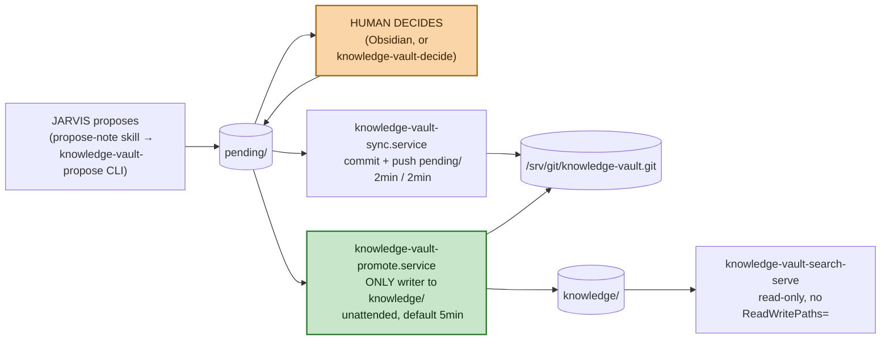

# knowledge-vault

A human-reviewed note pipeline: an agent (JARVIS) *proposes* an Obsidian-style
note into `pending/`, but nothing reaches the canonical `knowledge/` folder
until a human records an `approved` decision **and** an unattended promotion
timer picks it up. It is deliberately separate from JARVIS's own conversational
memory tooling (Engram) — Engram is an agent's own working context that nobody
reviews; knowledge-vault produces a document meant to outlive the conversation
and be trusted months later, so a human decision (never JARVIS) is what makes
a note real. It runs entirely as host-level systemd services on `trantor`,
never in Kubernetes.

The vault is one git working tree at `/opt/knowledge-vault/tree`, pushed
directly to the existing bare repo at `/srv/git/knowledge-vault.git` on branch
`main`. It has exactly two consumed top-level folders: `pending/` (JARVIS
writes, human decides) and `knowledge/` (promotion writes, search reads). Any
other folder that shows up in the tree (a stray `README.md`, a future
`drafts/`) is not a lifecycle stage and nothing in this package treats it as
one.

## Quick path

1. Install: `sudo hermes-native/knowledge-vault/scripts/install-host.sh <your-username>`
   — creates the system users/groups, state directories, and systemd units,
   but **enables nothing** (see [Safety model](#safety-model)).
2. Migrate existing notes into the tree (idempotent, never touches the old
   flat vault): `sudo -u knowledge-vault-promote scripts/migrate-to-tree.sh`.
3. Enable the unattended units: `sudo systemctl enable --now knowledge-vault-sync.timer knowledge-vault-promote.timer`.
4. Run one full cycle by hand — propose, decide, wait for (or manually start)
   sync and promote — and confirm the note lands in
   `/opt/knowledge-vault/tree/knowledge/<id>.md`. The installer's own printed
   walkthrough gives the exact commands; see
   [Running it locally / tests](#running-it-locally--tests).

## The pipeline

```
agent (JARVIS)                        human (Obsidian / editor)
      │                                        │
      ▼                                        │
[propose]  writes pending/<id>.md directly     │
           (renders OKF note + empty           │
            reviewer/decision/rationale +      │
            idempotency_key)                   │
                     │                         │
                     ▼                         ▼
         pending/<id>.md  ◀── human fills reviewer/decision/rationale
                     │        in place (Obsidian, or knowledge-vault-decide)
                     ▼
[sync]     commits + pushes pending/ to the bare remote
           (RW: .git + pending/ only — knowledge/ is ReadOnlyPaths=)
                     │
                     ▼
[promote]  unattended timer (default 5min, KNOWLEDGE_VAULT_PROMOTE_INTERVAL):
           scans pending/*.md, promotes every note that already has
           reviewer + decision: approved + rationale, skips the rest
           without error (D-04)
                     │
                     ├─► moves pending/<id>.md to knowledge/<id>.md  (id preserved)
                     ├─► strips reviewer/decision/rationale, records them
                     │   in the commit message instead (git history = audit trail)
                     ├─► rebuilds the search index
                     └─► pushes to /srv/git/knowledge-vault.git
                     ▼
[search]   knowledge-vault-search(-serve) reads only knowledge/**/*.md
           (allowlist by construction — pending/ is never enumerated)
```



These node links are confirmed working in local renders and in editors
whose Mermaid preview runs with a permissive security level (e.g. VS
Code's Mermaid preview extensions). They're confirmed **not** working on
github.com — GitHub's Content Security Policy blocks the navigation
outright, a long-standing, unresolved platform limitation (see
[github.com/orgs/community/discussions/17545](https://github.com/orgs/community/discussions/17545)).
On GitHub, use the "The 3 systemd units" table below instead.

Only `knowledge-vault-promote.service` writes to `knowledge/` — see
[Safety model](#safety-model) for why that's enforced twice (file
ownership/mode and systemd `ReadWritePaths=`/`ReadOnlyPaths=`), and for the
one thing it does *not* enforce (D-13, below).

`sync` and `promote` each read and write one directory of the vault tree; the
scan/index/search side reads only `knowledge/` and never anything else. There
is no phone-review branch and no `review-sync` unit anymore — offline review
retired with this restructure (design.md D-01) and has no replacement yet;
the manual substitute is cloning the single repo and editing `pending/` by
hand.

| Stage | Reads | Writes |
|---|---|---|
| propose | (agent stdin) | `pending/` |
| decide (human, in place) | `pending/<id>.md` | `pending/<id>.md` |
| sync | `pending/` (uncommitted changes), the bare remote | `pending/` (commit), the bare remote |
| promote | `pending/*.md` (checks `reviewer`/`decision`/`rationale`) | `knowledge/`, the search index, the bare remote |
| search(-serve) | `knowledge/` (read-only) | (nothing) |

## The 3 systemd units

`knowledge-vault-promote` and `knowledge-vault-sync` are `Type=oneshot`,
driven by a paired `.timer`, each with its own `User=knowledge-vault-*`,
`Group=knowledge-vault`; `knowledge-vault-search` is `Type=simple` (a
long-running server, no timer). None are enabled by `install-host.sh`.

| Unit | Timer (boot / repeat) | Does | Allowed to touch |
|---|---|---|---|
| `knowledge-vault-sync` | 2min / 2min | Commits and pushes `pending/` to the bare remote; never touches `knowledge/` | RW `<tree>/.git`, `<tree>/pending`, `<tree>/.vault.lock`; **RO `<tree>/knowledge`** |
| `knowledge-vault-promote` | 5min / 5min (default, `KNOWLEDGE_VAULT_PROMOTE_INTERVAL`) | The **only** unit that writes `<tree>/knowledge`; scans `pending/*.md`, promotes every note already carrying `reviewer`+`decision: approved`+`rationale`, skips the rest without error (D-04); rebuilds the search index; pushes | RW `<tree>/.git`, `<tree>/knowledge`, `<tree>/pending`, `<tree>/.vault.lock`, `/var/lib/knowledge-vault/{index,state}` |
| `knowledge-vault-search` | none (`Type=simple`, long-running) | Read-only HTTP search bridge (`POST /search`, `GET /healthz`) exposing `search_vault()` to memory-router's `KnowledgeVaultBackend` adapter over the `cni0` gateway; bearer-auth via `LoadCredential=`, bounded inline index rebuild | RO `<tree>` (via `KNOWLEDGE_VAULT_DIR`, scoped to `knowledge/` in code — D-01), RO index; **no `ReadWritePaths=` at all** |

All three share the same hardening baseline: `NoNewPrivileges=yes`,
`PrivateTmp=yes`, `PrivateDevices=yes`, `ProtectSystem=strict`,
`ProtectHome=yes`, `ProtectKernelTunables/Modules/ControlGroups=yes`,
`RestrictNamespaces=yes`, `LockPersonality=yes`, `SystemCallArchitectures=native`,
and an explicit `UMask=0027` (never inherited — see
[Safety model](#safety-model)). `knowledge-vault-search` additionally sets
`RestrictSUIDSGID=yes` and `MemoryDenyWriteExecute=yes`.
`knowledge-vault-promote` and `knowledge-vault-sync` deliberately **omit**
`RestrictSUIDSGID` — the shared vault tree and bare repo are
`core.sharedRepository=group`, which makes git mark directories setgid so
both accounts can write; `RestrictSUIDSGID` would turn every commit/push into
`EPERM` (F-6).

`knowledge-vault-search` is the only unit reachable over the network (a
node-local address only — see [Safety model](#safety-model)); `sync` and
`promote` only ever touch the local filesystem or the bare git repo.

`sync.service` is the one unit with `ReadOnlyPaths=<tree>/knowledge` set
explicitly — a second, kernel-enforced guarantee on top of the fact that
`sync.py` itself scopes every git call to `pending/` in code
(`GitSync._pending()`'s pathspec), so the property holds under test too, not
just under this unit file.

## Safety model

**Why promote is the only writer to `knowledge/`:** `pending/` is where an
agent proposal and a human decision both live; nothing there is canonical
until it is promoted. Promotion is the sole point where a `reviewer` +
`decision: approved` + `rationale` note becomes a file inside `knowledge/`.
This is enforced twice — by Unix file ownership/mode (only
`knowledge-vault-promote:knowledge-vault` owns `knowledge/`, mode `0750`) and
by systemd's `ReadWritePaths=`/`ReadOnlyPaths=` on the sync unit (`knowledge/`
is read-only to it) and the search unit (no write paths at all).

**Why JARVIS writes only `pending/`, never `knowledge/` — and D-04's
tradeoff.** `pending/` is group-writable `2770`, owned by the promote
account with JARVIS's own system user in the group; `knowledge/` is `0750`,
owned by promote alone. JARVIS's `knowledge-vault-propose` CLI exposes no
parameter that can target anything but `pending/<id>.md` (`propose.py`).
That boundary is kernel-enforced twice, exactly like the old publisher
invariant: file ownership/mode, plus (on JARVIS's own systemd unit, outside
this package) `ReadWritePaths=`/`InaccessiblePaths=` that exclude
`knowledge/`.

Promotion itself changed shape in this restructure: it used to require a
human to run `systemctl start knowledge-vault-promote@<id>` for every single
note — an explicit checkpoint before every promotion, even a trivially
approved one. It is now `knowledge-vault-promote.timer`, unattended, scanning
all of `pending/` on a fixed interval (default `5min`,
`KNOWLEDGE_VAULT_PROMOTE_INTERVAL`-configurable) and promoting anything
already eligible (design.md D-04). This was an explicit, confirmed tradeoff,
not an oversight — and it introduces a real, accepted risk documented next.

**D-13 — the self-approval risk, stated plainly, not glossed over.** Nothing
at the filesystem layer stops the JARVIS-owned process from writing
`reviewer: pedro`, `decision: approved`, and `rationale: ...` into a pending
note **it created itself**, before the promote timer next runs. The old
per-id manual trigger meant a human explicitly acted before every promotion
even if those fields were somehow already filled; the unattended timer
removes that last checkpoint. What remains kernel-enforced is the
`pending/` → `knowledge/` boundary (JARVIS still cannot write `knowledge/`
directly, ever); what is **not** enforced is who is allowed to fill
`reviewer`/`decision`/`rationale` inside `pending/` — that is a
`propose-note` SKILL.md instruction JARVIS is expected to obey, not something
the system can technically prevent. This was raised as an explicit risk
during design and **accepted by the user**, on the reasoning that this repo
already trusts JARVIS not to violate other skill-level instructions (e.g.
never claiming a note is saved before human approval), and that splitting
review-verdict fields into a file JARVIS cannot write was already rejected
once for polluting the OKF frontmatter with a second block. Revisit if this
ever runs multi-tenant, or with an agent whose trust level is lower than "the
operator's own agent" (design.md D-13).

**Why `sync`/`promote` aren't auto-enabled:** `install-host.sh` installs and
`daemon-reload`s all units/timers but enables none, and says so explicitly.
The install script's own printed instructions walk through one full manual
cycle (propose → decide → sync → promote) so an operator sees a real note
land in `knowledge/` before turning the timers on.

**Dedupe (F-7/D-10):** `propose.py` hashes the stripped note text (`sha256`)
as an `idempotency_key`, stored in the pending note's own frontmatter (the
old JSON spool that used to hold this key is gone). Re-proposing identical
text while the original is still in `pending/` returns the existing pending
note's path and writes nothing new. This covers `pending/` only — dedupe does
not span already-published notes in `knowledge/`; re-proposing text that was
already promoted creates a new pending duplicate, which a human rejects in
one word (an accepted tradeoff, design.md D-10 Open Question).

**Why `knowledge-vault-search` cannot write anything:** the unit's
`ReadOnlyPaths=` covers the vault tree (scoped to `knowledge/` in code) and
the index path, and it declares **no `ReadWritePaths=` at all** — not even a
scratch directory. The handler code itself has no write path either: it
exposes exactly `POST /search` and `GET /healthz`, no `do_PUT`/`do_DELETE`,
and a mutating request to any other path/method is rejected before touching
the vault. Bound to the `cni0` gateway address (`10.42.0.1`, reachable only
from pods on this node, never from the LAN), so the network surface this unit
introduces is both read-only and node-local by construction. `POST /search`
requires a `Bearer` token sourced from `LoadCredential=`
(`$CREDENTIALS_DIRECTORY`, never a repo file, never an env var), checked with
`hmac.compare_digest` before any vault read; `GET /healthz` is the one
unauthenticated route, for Kubernetes-style liveness probing, and touches no
vault file either. A stale index that cannot be rebuilt raises a typed
`IndexUnavailable` instead of leaking an `OSError`, which the server maps to
`503 {"error": "index_unavailable"}`.

**Why promote is the actor that rebuilds the search index:** promote is the
only actor that can change `knowledge/`, so it is the only actor whose action
can invalidate the index — rebuilding it there is both correct and free, and
lets the search unit keep zero write paths (design.md D-07).

**Vault tree ↔ bare remote:** the vault tree at `/opt/knowledge-vault/tree`
*is* the git repository now — there is no scratch-worktree copy step left
(the old `mirror.py`'s `_mirror_files()` is gone). `sync` and `promote` both
push directly to `/srv/git/knowledge-vault.git` on branch `main`. Two
accounts writing one shared working tree's `.git` (`core.sharedRepository=
group`) is the same pattern the old `mirror`/`review-sync` units already used
safely — not a new risk shape (F-6).

Both `sync` and `promote` serialize on one explicit `fcntl.flock(LOCK_EX)`
over `<tree>/.vault.lock` (`layout.vault_lock()`, design.md D-08) rather than
trusting git's own lock, which would otherwise surface as an opaque
`CalledProcessError` a timer would retry blindly.

**Manual `git mv` is a still-visible, unaudited escape hatch (D-06):** a
human can bypass `knowledge-vault-promote` entirely with a bare `git mv` from
`pending/` to `knowledge/`. This is never blocked, but `promote --check`
(`check_published()`, also run at the start of every `promote` invocation)
reports any note under `knowledge/` still carrying `reviewer`/`decision`/
`rationale` and exits non-zero — it catches an unstripped hand-`mv`; it
cannot catch a hand-`mv` of a note that never had review fields to begin
with, which is stated, not papered over.

**What "atomic" means here:** file writes, not git commits — `atomic.py`'s
`write_atomic()` writes to a `NamedTemporaryFile` in the *same directory* as
the target (so the rename is same-filesystem), `fsync`s the file, `chmod`s it
to an explicit mode (never the caller's inherited umask, which differs
between a systemd unit and a manual `sudo -u` run), `os.replace()`s it over
the target, then also `fsync`s the *directory fd* so the rename itself is
durable. On any `OSError` the temp file is unlinked and the target is left
untouched — no partial file is ever visible to a concurrent reader. Git
commits (in `sync.py`, `promote.py`) are a separate, coarser unit of
durability on top of this — they group already-atomically-written files into
one commit, but the atomicity guarantee itself is per-file, not per-commit.

## What this does NOT automate

- **A real control-plane approval API.** There is none; a human edits
  `pending/<id>.md`'s `reviewer`/`decision`/`rationale` fields directly
  (Obsidian, a text editor, or `knowledge-vault-decide`).
- **Self-approval prevention (D-13).** See above — this is a documented,
  accepted risk, not a gap this change silently closes.
- **Phone / offline review.** Retired with `review-sync` and the separate
  `pending` git branch (design.md D-01); no replacement exists yet. The
  manual substitute is cloning the vault repo and editing `pending/` by hand;
  a real mobile surface is a separate, future change.
- **Retitle / alias-merge on promotion (D-09).** The old publisher's
  alias-preserving retitle path is gone. Promotion refuses outright if
  `knowledge/<id>.md` already exists rather than merging aliases — a real
  capability regression, recorded as such, not silently dropped.
- **Cleanup of the old flat vault.** `/opt/knowledge-vault/vault` and the old
  `/var/lib/knowledge-vault/{proposals,pending,decisions,approved,publisher,
  review,mirror}` directories are left in place after migration. Deleting
  them is an explicit, separate follow-up (design.md Migration step 8).

## Configuration

Every path is passed via environment variable, set per-unit in the `.service`
files (`install-host.sh` never hardcodes paths into the Python packages
themselves):

| Env var | Used by | Default (as set by systemd) |
|---|---|---|
| `KNOWLEDGE_VAULT_DIR` | propose, decide, promote, promote-check, sync, search, search-serve | `/opt/knowledge-vault/tree` |
| `KNOWLEDGE_VAULT_INDEX` | promote (optional, rebuilds after a batch), search, search-serve | `/var/lib/knowledge-vault/index/index.json` |
| `KNOWLEDGE_VAULT_REMOTE` | promote, sync (both optional — omit to operate purely locally) | `/srv/git/knowledge-vault.git` |
| `KNOWLEDGE_VAULT_BRANCH` | promote, sync | `main` |
| `KNOWLEDGE_VAULT_PROMOTE_INTERVAL` | `install-host.sh` only (writes a systemd timer drop-in; not read by any Python module) | `5min` |
| `KNOWLEDGE_VAULT_AGENT` | propose | set by the caller (e.g. `jarvis`) |
| `KNOWLEDGE_VAULT_REVIEWER` | decide | reviewer identity for the recorded decision |
| `KNOWLEDGE_VAULT_DECISION_SOURCE` | decide | optional, e.g. `telegram`/`phone` |
| `KNOWLEDGE_VAULT_SEARCH_HOST` | search-serve | `10.42.0.1` (the `cni0` gateway) |
| `KNOWLEDGE_VAULT_SEARCH_PORT` | search-serve | `8088` |
| `KNOWLEDGE_VAULT_SEARCH_TIMEOUT_SECONDS` | search-serve | `5` — bounds an inline stale-index rebuild; a timed-out rebuild returns `503`, not a hang |
| `KNOWLEDGE_VAULT_SEARCH_LIMIT_MAX` | search-serve | `20` — caller `limit` is clamped into `1..MAX` |
| search-serve bearer token | search-serve | `LoadCredential=search-token:/etc/knowledge-vault/search-token`, read from `$CREDENTIALS_DIRECTORY` — never an env var, never a repo file |
| `CREDENTIALS_DIRECTORY` | search-serve | set by systemd from `LoadCredential=` |

`install-host.sh` also takes one optional positional argument, the reviewer
username (defaults to `$SUDO_USER`): it's added to the `knowledge-vault`
group and gets the `propose-note` skill installed into
`~/.hermes/skills/propose-note/` if that directory exists. Skip it and the
script prints a warning that "nobody can write decisions yet" — it still
installs everything else.

## Search deployment (in-cluster bridge)

`knowledge-vault-search.service` is the one unit reachable from Kubernetes —
everything else in this doc stays purely host-side. It is meant to run
**enabled and persistent** on `trantor` (`systemctl enable --now`), not
started by hand: `install-host.sh` provisions the credential
(`/etc/knowledge-vault/search-token`, `root:$GROUP`, `0440`,
`openssl rand -hex 32`, never overwritten if it already exists) but does not
enable the unit itself — the same "install-and-verify, not
install-and-enable" posture as `sync`/`promote`.

In-cluster reachability is a selector-less, headless `Service` +
manually-managed `EndpointSlice` in `mcps`
(`kubernetes/mcps/knowledge-vault-search-endpoints.yaml`) pointing at
`10.42.0.1:8088` — the host's `cni0` gateway address on the single-node
flannel CNI `trantor` runs today. This is an accepted, documented
constraint, not an oversight: it couples the bridge's reachability to two
things staying true — no CNI change, and memory-router staying scheduled on
this same node. Either one changing invalidates `10.42.0.1` and is a
breaking change requiring a manifest update, not a network-layer surprise.
A manifest test asserts the address so any change is deliberate
(`tests/test_knowledge_vault_search_manifest.py`). See
`specs/024_knowledge_vault_search_deployment.md` for the full deployed
contract, including the live-deployment evidence (`is-enabled`/`is-active`/
`NRestarts`/journal/`ss`, pre- and post-reboot).

memory-router reaches the bridge via `KNOWLEDGE_VAULT_TOKEN` (a
`secretKeyRef` into the `knowledge-vault-search-token` Secret, never an
inline value) and `KNOWLEDGE_VAULT_AUTH_MODE=bearer`
(`kubernetes/mcps/memory-router-deployment.yaml`). No
`KNOWLEDGE_VAULT_BASE_URL` override — the adapter's default already names
`knowledge-vault-search.mcps.svc.cluster.local:8088`.

### Token rotation runbook

The host file (`/etc/knowledge-vault/search-token`) is the single source of
truth; the Kubernetes Secret is a **mirror only** — nothing ever
regenerates the token from the cluster side
(`kubernetes/mcps/bootstrap/03-create-secrets.sh` block 7). Rotation is a
manual, ordered, four-step runbook, not automated (design.md D-03 of
`knowledge-vault-search-deployment`) — it touches three independently
managed boundaries (host file, systemd, k8s Secret), which is more moving
parts to automate than the failure it would prevent:

1. **Regenerate the host credential**:
   ```bash
   sudo openssl rand -hex 32 | sudo tee /etc/knowledge-vault/search-token >/dev/null
   sudo chmod 0440 /etc/knowledge-vault/search-token
   ```
2. **Restart the unit so it re-reads the new credential**:
   ```bash
   sudo systemctl restart knowledge-vault-search.service
   ```
3. **Re-run the secret-mirroring script** so the `mcps` Secret matches the
   new host file (recreates the Secret, does not regenerate the token):
   ```bash
   kubernetes/mcps/bootstrap/03-create-secrets.sh
   ```
4. **Roll memory-router** so its pod picks up the refreshed Secret (env
   vars are not live-reloaded) and confirm a real hit:
   ```bash
   kubectl -n mcps rollout restart deploy/memory-router
   kubectl -n mcps rollout status deploy/memory-router
   # then issue a /global search matching curated vault content and
   # confirm a hit with backend == "knowledge-vault"
   ```

Steps 2 and 4 both re-read the credential from their own side; between them
`/global` degrades to Engram-only (the adapter raises
`BackendUnavailableError` on a `401` and the dispatcher degrades over it),
which is the pre-change baseline, not an outage. Running the steps out of
order (e.g. rolling memory-router before re-running step 3) produces the
same degrade, self-correcting once the remaining step runs.

## Running it locally / tests

```bash
cd hermes-native/knowledge-vault
python3 -m venv /tmp/venv-doc-kv
/tmp/venv-doc-kv/bin/pip install -q -e .
/tmp/venv-doc-kv/bin/python -m unittest discover -s tests -v
```

The suite uses `tempfile` directories throughout, not the real
`/var/lib/knowledge-vault` paths; `test_serve.py` spins up a real
`ThreadingHTTPServer` on `127.0.0.1` with an ephemeral port, never the
configured `10.42.0.1` bind address; `test_promote.py`/`test_sync.py` exercise
a real temporary `git init` repo, not a mock.

## How an agent proposes a note

The `propose-note` skill (`skills/propose-note/SKILL.md`, installed to
`~/.hermes/skills/propose-note/` by the installer) is what JARVIS actually
loads. Key points it teaches the agent:

- **Not `memory`.** `memory`/Engram is the agent's own working context that
  nobody reviews; this produces a document for the human to approve.
- **`pending/` only, always through the CLI.** JARVIS never writes a file
  directly and never touches `knowledge/` — the only path in is piping
  rendered Markdown into `knowledge-vault-propose`'s stdin.
- One idea per note (Zettelkasten rule) — "and also" means write a second
  note and link them.
- Only `type` is a required frontmatter field (`decision`, `infra-fact`,
  `root-cause`, `convention`, `concept`, ...); never write `id`, `title`, or
  `timestamp` yourself — `knowledge-vault-propose` fills those in when it
  renders the note, and title comes from the note's first Markdown heading.
- Submission is a straight pipe, no proposal library call:
  ```bash
  printf '%s' '---
  type: infra-fact
  tags: [storage, k3s]
  ---
  # Longhorn no esta instalado en trantor

  El unico storage class es `local-path`. Verificado el 2026-08-04.' \
    | KNOWLEDGE_VAULT_AGENT=jarvis \
      KNOWLEDGE_VAULT_DIR=/opt/knowledge-vault/tree \
      /opt/knowledge-vault/.venv/bin/knowledge-vault-propose telegram
  ```
  It prints the new note's id. `propose()` itself hashes the note text and
  refuses a `type`-less note before anything is written, and resubmitting
  identical text returns the path of the already-pending note instead of
  creating a duplicate.
- Before proposing, the skill tells the agent to `knowledge-vault-search
  <query>` the existing vault so it links to real note ids rather than
  paraphrasing or guessing them.
- After proposing, the agent tells the human in one line what it proposed —
  and explicitly must **not** claim anything was saved, published, or is
  searchable: nothing is real until a human decides and promotion runs.
- The skill also states outright, as a trust boundary, not a mechanism: never
  pre-fill or suggest `reviewer`/`decision`/`rationale` values (D-13).

## Common modifications

- **Changing what a note requires:** the only hard requirement is OKF
  `type`, enforced in two independent places — `propose.py:propose()`
  (rejects before writing to `pending/`) and `note.render()` (raises
  `MissingType`). Add a new required field in both, or promotion may accept a
  note that skipped one of them.
- **Adding a second sync/promote target:** `sync.py`'s `GitSync` and
  `promote.py`'s `promote()`/`promote_all()` both take `remote`/`branch`
  parameters — point a second instance at another bare repo path with its own
  `KNOWLEDGE_VAULT_REMOTE`, running against the same `/opt/knowledge-vault/tree`
  working tree (both instances share the tree, so they still serialize
  through `layout.vault_lock()`).
- **Changing the review UI/flow:** the "UI" is literally the OKF frontmatter
  block written into `pending/<id>.md` by `propose()` — Obsidian (or a text
  editor, or `knowledge-vault-decide`) opens it, the human fills `reviewer:`,
  `decision:`, `rationale:` in place. Changing the reviewed fields means
  editing `propose.py`'s `_EMPTY_REVIEW_FIELDS`, `review.py`'s
  `PENDING_FIELDS`, and `promote.py`'s `_validate()` together — they must
  agree on what's mandatory.
- **Changing the promote interval:** re-run `install-host.sh` with
  `KNOWLEDGE_VAULT_PROMOTE_INTERVAL=<value>`, or hand-edit/`systemctl edit
  knowledge-vault-promote.timer` — the installer writes a drop-in rather than
  editing the shipped unit, so this is genuinely configurable without
  patching the package.

## Troubleshooting

- **A proposal never shows up in `pending/`:** check the CLI's own stderr —
  `propose()` raises `ValueError` for a `type`-less or empty note before
  writing anything, printed as `knowledge-vault propose: <reason>`. Also
  check `pending/`'s owner/mode: it must be group-writable (`2770`) by
  JARVIS's system user.
- **A decision is written but never picked up:** `promote.py`'s `_validate()`
  requires non-empty `reviewer`, `rationale`, and `decision: approved` — a
  note missing any of them is silently skipped (expected steady state, not an
  error) on every `promote_all()` run until it's complete. It also refuses a
  note whose `pending/` edit hasn't been committed by `sync` yet
  ("not yet committed by sync; try again next cycle") — that resolves itself
  once the next `sync` run commits the reviewer's edit.
- **A note is decided but never lands in `knowledge/`:** check
  `journalctl -u knowledge-vault-promote.service` for the exact
  `PromotionRefused` reason, or run `knowledge-vault-promote-check` — it
  flags a note already in `knowledge/` that still carries review fields
  (unstripped hand `git mv`), but an `OSError`/git failure on a specific note
  is retried, not permanently blacklisted (`promote_all()` logs "failed, will
  retry" to stderr and moves on).
- **"another writer owns the vault lock":** `sync` and `promote` both take
  `fcntl.flock(LOCK_EX | LOCK_NB)` on `<tree>/.vault.lock`
  (`layout.vault_lock()`); a contended lock fails fast with `VaultLocked`
  rather than hanging. `flock` releases automatically on process exit, so a
  persistent contention message across multiple timer runs means a genuinely
  hung process, not a stale lock file — check `systemctl status
  knowledge-vault-{sync,promote}.service`.
- **Sync/promote push failure:** neither unit force-pushes or rewrites
  history; a rejected non-fast-forward push after manual intervention on the
  bare repo needs a manual reconciliation inside `/opt/knowledge-vault/tree`.
  `sync.py`'s `_adopt_remote()` refuses to `reset --hard` over uncommitted
  local changes rather than discarding a reviewer's just-made decision
  silently (`AdoptRemoteRefused`) — check
  `journalctl -u knowledge-vault-{sync,promote}.service` for the actual git
  error.
- **Phone / offline review:** there is no replacement for the old
  `review-sync` unit and `pending` branch (design.md D-01). The manual
  substitute is cloning `/srv/git/knowledge-vault.git` and editing `pending/`
  directly, then letting the next `sync` push it back.

## See also

- `docs/architecture/README.md` — system-wide map; see its "knowledge-vault
  (host)" subsystem entry and the [host/cluster split](architecture/README.md#two-runtimes-one-machine).
- `docs/glossary.md` — see **systemd unit / timer** and the general project
  vocabulary this doc assumes.
- `specs/004_hermes_native_clone_systemd.md` — the native systemd install
  spec this package's install pattern follows.
- `specs/023_knowledge_vault_restructure.md` — the SDD spec for this
  restructure (single-branch, two-folder vault, unattended promotion, D-13).
- `openspec/changes/knowledge-vault-restructure/` — the proposal, design, and
  task breakdown for this restructure.
- `openspec/changes/approved-knowledge-vault/` — the original proposal,
  design, and task breakdown for the vault subsystem this restructure builds
  on.
