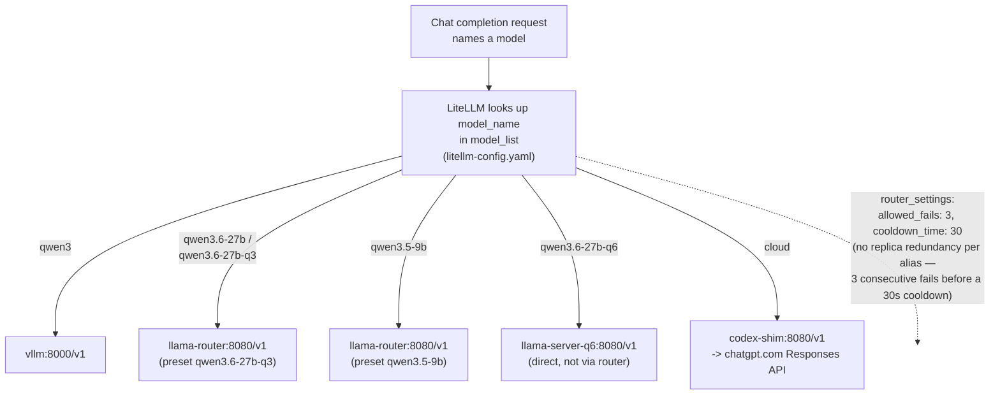

# llama-service, LiteLLM, and codex-shim

These three pieces together are the model-serving layer everything else in
this project calls through: `kubernetes/llama-service/` runs the local Qwen
models on the single RTX 4070 Ti SUPER (16 GiB VRAM), `kubernetes/proxy/`
(LiteLLM) is the one external routing layer every caller — Hermes, the
intent-orchestration plugin, model-panel — actually talks to, and
`kubernetes/codex-shim/` proxies Codex/ChatGPT cloud requests behind the same
OpenAI-compatible shape so the `cloud` alias is just another backend LiteLLM
can point at. No caller ever talks to a llama.cpp/vLLM pod or to Codex
directly; everything goes through LiteLLM on `192.168.1.241:4000`. See
[docs/glossary.md](../glossary.md) and
[docs/architecture/README.md](../architecture/README.md) if any term here is
unfamiliar.

## Quick path

1. Create `llms/litellm-auth` (`master-key`, `llama-api-key`) and, if you
   want Cloud mode, `llms/codex-shim-auth` + `llms/codex-shim-key` — see
   [Deploying from scratch](#deploying-from-scratch).
2. `kubectl apply -k kubernetes/llama-service` — creates PVCs, the router
   ConfigMap, all Deployments (all at `replicas: 0` except `llama-router`),
   Services.
3. Run the model-download Jobs you need (daily is required for the router to
   ever come up; large/q3, q6 are optional) — see the table below.
4. `kubectl apply -f kubernetes/proxy/litellm-config.yaml` then
   `kubectl apply -k kubernetes/codex-shim/` (after the codex-shim secrets
   bootstrap, see [codex-shim: cloud proxy](#codex-shim-cloud-proxy)).
5. Verify: `curl http://192.168.1.241:4000/v1/models -H "Authorization: Bearer $LITELLM_MASTER_KEY"`
   should list every alias from the table in
   [LiteLLM routing](#litellm-routing).

## The serving stack, end to end

```
caller (Hermes, intent-orchestration, model-panel, ...)
  |
  v
LiteLLM  (LoadBalancer 192.168.1.241:4000, single routing layer)
  |
  +-- alias "qwen3"          --> vllm.llms.svc.cluster.local:8000/v1
  |                               (or codex-shim, after a GPU handoff to Cloud)
  |
  +-- alias "qwen3.5-9b"      --+
  +-- alias "qwen3.6-27b"       +--> llama-router.llms.svc.cluster.local:8080/v1
  +-- alias "qwen3.6-27b-q3"  --+    (--models-max 1: exactly one of the two
  |                                   presets is ever resident)
  |
  +-- alias "qwen3.6-27b-q6"  --> llama-server-q6.llms.svc.cluster.local:8080/v1
  |                               (direct — never through the router, only
  |                                after vLLM/llama-router are stopped)
  |
  +-- alias "cloud"           --> codex-shim.llms.svc.cluster.local:8080/v1
                                   --> https://chatgpt.com/backend-api/codex/responses
```

Only one GPU-consuming Deployment may run at a time: `vllm`, `llama-server`,
`llama-server-q3`, `llama-server-q6`, and `llama-router` all request
`nvidia.com/gpu: 1` and all use `strategy: Recreate` for that reason (a
`RollingUpdate` would try to hold the old and new pod's GPU claim
simultaneously and deadlock — see spec 001 §A8). `codex-shim` and `litellm`
request no GPU and can always run.

## Model variants

| Variant | Deployment | Quantization | Size | VRAM/RAM (request/limit) | GPU layers | Used when |
|---|---|---|---|---|---|---|
| **daily** | `llama-router` (preset `qwen3.5-9b`) | Qwen3.5-9B Q6_K | 7.46 GB (7,458,301,152 B) | router pod: 16Gi/32Gi RAM | fully resident | default interactive model, preloaded at router startup (`load-on-startup: true`) |
| **large** | `llama-router` (preset `qwen3.6-27b-q3`) | Qwen3.6-27B Q3_K_S | 12.36 GB / 11.510 GiB | router pod: 16Gi/32Gi RAM | 65/65 layers, fully GPU-offloadable | on-demand heavier tasks, loaded via `switch-model.sh large` |
| **q3 (standalone)** | `llama-server-q3` | Qwen3.6-27B Q3_K_S | same file as large | 16Gi/32Gi RAM, `nvidia.com/gpu: 1` | 65/65 layers | manual/isolated testing outside the router |
| **q6** | `llama-server-q6` | Qwen3.6-27B UD-Q6_K_XL | 25.64 GB / 23.876 GiB | 32Gi/44Gi RAM, `nvidia.com/gpu: 1` | hybrid: `--fit-target 4096` reserves ~4 GiB VRAM margin, rest offloads what fits, remainder + KV cache stays in host RAM | higher-fidelity runs where slower CPU/PCIe-bound decode is acceptable |
| **base (IQ4_XS)** | `llama-server` | Qwen3.6-27B IQ4_XS | 15.44 GB | 24Gi/48Gi RAM, `nvidia.com/gpu: 1` | `--fit-target 2048` | legacy/original variant, superseded by q3 for interactive use |

Real numbers from the live benchmarks (specs 006/007/008):

- **q3**: offloaded 65/65 layers, used 11,254.73 MiB CUDA buffer, left
  ~2,982 MiB VRAM free after a 31.5K-token benchmark. ~70% faster decode
  than the base variant at short context, ~59% faster at 31.5K.
- **q6**: doesn't fit the 16,376 MiB GPU at all — llama.cpp reserves ~4 GiB
  margin and keeps whatever doesn't fit in host RAM (needs ~4 GiB KV F16 per
  slot plus buffers). More PCIe/CPU-bound, so slower decode than q3.
- **daily (9B)**: ~8,068 MiB VRAM, >7 GiB free. 82.2 tok/s decode with
  thinking, 93-147 tok/s without.
- **large (27B q3) via router**: 16.45 tok/s decode during a sustained
  256-token generation in the isolated daily→large→daily switch test.

All GGUF files come from `unsloth/*-GGUF` repos, size- and SHA-256-verified
by the download Jobs (see [Deploying from scratch](#deploying-from-scratch)).
Qwen itself does not publish these GGUF files — only the BF16/safetensors
base weights; Unsloth publishes the quantizations.

## LiteLLM routing

`kubernetes/proxy/litellm-config.yaml` is one manifest: a ConfigMap
(`litellm-config`, holding both `config.yaml` and an inline
`litellm_callbacks.py`), the `litellm` Deployment, and its `LoadBalancer`
Service. There is no separate callbacks file on disk — it's a literal block
inside the ConfigMap's `data`.



These node links are confirmed working in local renders and in editors
whose Mermaid preview runs with a permissive security level (e.g. VS
Code's Mermaid preview extensions). They're confirmed **not** working on
github.com — GitHub's Content Security Policy blocks the navigation
outright, a long-standing, unresolved platform limitation (see
[github.com/orgs/community/discussions/17545](https://github.com/orgs/community/discussions/17545)).
On GitHub, use the table below instead.

Every alias below is controlled by the same single file — **changing this
routing is a one-file edit**:

| Alias | Backend | Controlling file |
|---|---|---|
| `qwen3` | `vllm:8000/v1` | `kubernetes/proxy/litellm-config.yaml` |
| `qwen3.6-27b` | `llama-router:8080/v1` (preset `qwen3.6-27b-q3`) | `kubernetes/proxy/litellm-config.yaml` |
| `qwen3.6-27b-q3` | `llama-router:8080/v1` (preset `qwen3.6-27b-q3`) | `kubernetes/proxy/litellm-config.yaml` |
| `qwen3.6-27b-q6` | `llama-server-q6:8080/v1` (direct) | `kubernetes/proxy/litellm-config.yaml` |
| `qwen3.5-9b` | `llama-router:8080/v1` (preset `qwen3.5-9b`) | `kubernetes/proxy/litellm-config.yaml` |
| `cloud` | `codex-shim:8080/v1` | `kubernetes/proxy/litellm-config.yaml` |

| Alias | Backend | Notes |
|---|---|---|
| `qwen3` | `vllm.llms.svc.cluster.local:8000/v1` | `api_key: "not-needed"` — vLLM doesn't enforce its own key, LiteLLM's master key is the outward-facing auth. Rewritten to `codex-shim` by model-panel during a Cloud handoff. |
| `qwen3.6-27b` | `llama-router:8080/v1`, model `qwen3.6-27b-q3` | Stable alias name for the "large" profile — always points at the router's q3 preset. |
| `qwen3.6-27b-q3` | same router, same preset | Explicit alias if you want to name the quant directly instead of the friendly `qwen3.6-27b` name. |
| `qwen3.6-27b-q6` | `llama-server-q6:8080/v1` direct | Only reachable after vLLM and every other GPU-consuming llama.cpp Deployment are stopped — it's not behind the router. |
| `qwen3.5-9b` | `llama-router:8080/v1`, model `qwen3.5-9b` | The "daily" profile. |
| `cloud` | `codex-shim:8080/v1`, model `gpt-5.6-sol` | `api_key: os.environ/CODEX_SHIM_KEY` — a separate internal-bearer secret from `litellm-auth`. |

`router_settings`:

```yaml
router_settings:
  enable_pre_call_checks: true
  allowed_fails: 3   # LiteLLM's own default is 1
  cooldown_time: 30
```

The comment in the manifest explains why `allowed_fails` is bumped from
LiteLLM's default of 1 to 3: every alias here has exactly one instance
behind it (no replica redundancy), so the default would blackhole an entire
model alias for a full cooldown window (60s default, here 30s) on one
transient blip — e.g. right as a pod restarts. This was found live, not
speculatively (Amendment 5 in the manifest history).

`litellm_callbacks.max_output_tokens_cap` (`MaxOutputTokensCap`, a
`CustomLogger.async_pre_call_hook`) caps `max_tokens` /
`max_completion_tokens` / `max_output_tokens` / `n_predict` — and the
equivalent fields nested under `extra_body` — to **16,384** for every local
llama.cpp alias (`qwen3.5-9b`, `qwen3.6-27b*` in all their `model_name` and
`openai/...` and `llama-cpp-...` id spellings). If the caller sends no
token-limit field at all, the callback injects one (`max_output_tokens` for
Responses-API call types, `max_tokens` for everything else) rather than
letting the request go through unbounded. Invalid values (non-int, bool, <1)
raise a `400`. `qwen3` (vLLM) and `cloud` are **not** in `MODEL_NAMES`, so
this cap does not apply to them.

Other settings worth knowing: `drop_params: true` because Hermes sends
`reasoning_effort`, which vLLM/qwen3 doesn't support — without this LiteLLM
would 400 instead of silently ignoring it. `general_settings` has no virtual
keys or Postgres — the master key is the only auth, and
`allow_requests_on_db_unavailable: false` means it fails closed rather than
falling back to an anonymous `INTERNAL_USER`.

## Switching models

`switch-model.sh daily|large` (in `kubernetes/llama-service/`) is the CLI
path for the router; model-panel's profile toggle for Local mode calls the
same router underneath. Step by step:

1. Validates preconditions: every non-router GPU Deployment
   (`vllm`, `vllm-big-model`, `vllm-small-model`, `llama-server`,
   `llama-server-q3`, `llama-server-q6`) must be at `replicas: 0` (or
   absent), and `llama-router` must be at `replicas: 1`. It refuses to run
   otherwise.
2. Captures `litellm`'s current replica count and whether
   `hermes-gateway.service` is currently active, so it can restore both on
   exit (even on failure — wired via a `trap ... EXIT`, tracked with a
   `SUCCESS` flag).
3. Stops `hermes-gateway.service` (if it was running) and scales `litellm`
   to 0, waiting for its pod to fully terminate — this ensures no live
   traffic hits the router mid-switch.
4. `kubectl exec`s into the `llama-router` pod and issues a single
   `/v1/chat/completions` request for the target model
   (`max_tokens: 1`, `chat_template_kwargs: {enable_thinking: false}`) —
   this call **blocks until the router has fully loaded the selected
   model** (llama.cpp's own preset autoload semantics), which is exactly
   the synchronization point the script needs.
5. Runs `hermes config set model.default "$MODEL"`.
6. Restores `litellm`'s replica count (and waits for rollout if it was >0)
   and restarts `hermes-gateway.service` if it had been stopped.
7. Prints `Active model: <daily|large alias>` on success.

The router itself (`router-config.yaml`'s `models.ini`, mounted by
`deployment-router.yaml`) is what actually holds the two presets:

```ini
[qwen3.5-9b]
model = /models/daily/Qwen3.5-9B-Q6_K.gguf
load-on-startup = true
...
[qwen3.6-27b-q3]
model = /models/large/Qwen3.6-27B-Q3_K_S.gguf
load-on-startup = false
...
```

with `--models-max 1` on the router container args — llama.cpp fully
unloads whichever model is resident before loading the other, so there is
never a moment with both in VRAM. The router's `startupProbe` explicitly
waits for the 9B (`/health?model=qwen3.5-9b&autoload=false`) so it doesn't
report ready before the daily preset has actually finished loading.

**Concurrency gotcha called out in spec 008 and worth repeating**: don't
send an isolated request selecting the 27B while Hermes's own gateway
traffic is still hitting the 9B — with `--models-max 1` the two request
streams evict each other's model repeatedly. Always go through
`switch-model.sh` (or model-panel's profile toggle), which stops
Hermes-generated traffic first.

## codex-shim: cloud proxy

`codex-shim` is a FastAPI app (`kubernetes/codex-shim/app/`) that proxies
Codex/ChatGPT cloud calls behind an OpenAI-compatible `/v1` surface, so
LiteLLM's `cloud` alias can treat it like any other backend.

### API surface

| Route | Auth | Does |
|---|---|---|
| `GET /healthz` | none | Liveness only — does **not** assert session validity. |
| `GET /internal/session` | none (cluster-internal only, no Ingress) | Calls `ensure_fresh()` (not a cached read) so it reflects the real session state, then returns `{state, expires_at, last_refresh, last_error_code, reason}` — explicitly never token material. This is what model-panel polls (`GET /api/status`) before allowing a switch to Cloud. |
| `GET /v1/models` | internal bearer (`CODEX_SHIM_INTERNAL_KEY`) | Lists the single configured model (`gpt-5.6-sol` by default via `CODEX_CLOUD_MODEL`). |
| `POST /v1/chat/completions` | internal bearer | Translates Chat Completions <-> Responses API both directions, streaming and non-streaming. |
| `POST /v1/responses` | internal bearer | Near-passthrough — LiteLLM's own `responses_api_bridge_check` sends already-Responses-shaped bodies here directly for gpt-5.4+ models when a request carries both `reasoning_effort` and `tools` (Hermes does, on every agentic turn — this is the common path, not an edge case). |

The internal bearer check (`_check_internal_bearer` in `proxy.py`) fails
**closed** if `CODEX_SHIM_INTERNAL_KEY` is unset (`503`, never treats unset
as "open").

### Why its own session, and how refresh actually works

`codex-shim` owns a dedicated Codex OAuth session — deliberately separate
from Hermes's own `hermes auth` session. The mechanism (`codex_auth.py`,
vendored from Hermes's own `hermes_cli/auth.py`,
`refresh_codex_oauth_pure`): Codex's **refresh token is single-use and
rotates server-side on every refresh**. If two independent refreshers shared
one token pair, whichever refreshes second gets `refresh_token_reused` and
silently invalidates the other's session. This is a hard mechanic, not a
policy preference — there's no way to share credentials safely here.

- **`TokenStore`** (`store.py`) reads/patches the `codex-shim-auth` Secret
  directly via the Kubernetes API — never a mounted volume, because a token
  store needs read-back-and-write and projected volumes are read-only and
  lag the kubelet sync period. It derives `expires_at` from the access
  token's JWT `exp` claim and caches it in the Secret so the hot path never
  re-parses the JWT. Notable defensive fix: if a refreshed token's `exp`
  fails to parse, the store falls back to the *previous* `expires_at`
  instead of dropping it — an earlier version silently stopped proactive
  refresh forever in that case, relying solely on reactive 401s.
- **`SessionManager`** (`session.py`) is single-flight: one `asyncio.Lock`
  shared by both the proactive path (`ensure_fresh()`, called on every
  `/internal/session` poll and before every proxy call) and the reactive
  path (`handle_401_and_retry()`, triggered when upstream returns 401 —
  refreshes exactly once, retries the caller's request exactly once).
  `MIN_PROACTIVE_REFRESH_RETRY_INTERVAL_SECONDS = 30` throttles repeated
  proactive refresh attempts — found live: model-panel polls
  `/api/status` every 2s, and without this throttle a token stuck in the
  skew window with a failing refresh (rate-limited, network blip) would
  hammer the OAuth token endpoint on every single poll.
- RBAC (`rbac.yaml`) grants the `codex-shim` ServiceAccount only
  `get`/`patch`/`update` on the single named Secret `codex-shim-auth` — no
  `list`/`watch` (Kubernetes forbids `resourceNames` with those verbs
  anyway), no access to Deployments/ConfigMaps/ScaledObjects. The Pod itself
  cannot create the Secret — that's a one-time manual bootstrap step.

Session states: `not_configured`, `valid`, `expiring_soon`, `rate_limited`,
`expired_needs_relogin`, `refresh_failed`.

### Chat Completions <-> Responses API translation (`codex_translate.py`)

Codex's real upstream (`https://chatgpt.com/backend-api/codex/responses`)
only speaks the Responses API, and it has two hard account-specific
constraints confirmed live: it rejects `stream` omitted/false, and it
rejects `store` anything but `false`. So `codex-shim` always asks upstream
to stream, and `stream: false` from the caller only controls whether it
buffers the SSE events into one JSON response or forwards them as they
arrive.

- **Request side** (`build_responses_request`, `_chat_messages_to_responses_input`,
  `_responses_tools`) — vendored verbatim from Hermes's own
  `codex_responses_adapter.py`. The one non-obvious edge case it exists to
  handle: a Chat Completions `role: "tool"` message must be re-encoded as a
  Responses `function_call_output` item, or the Responses API rejects it
  outright. Tool-call IDs get remapped (`fc_<x>` -> `call_<x>`) so a
  `function_call`/`function_call_output` pair always matches on both sides
  of a tool round-trip.
- **Non-streaming assembly** (`assemble_chat_completion`) — the terminal
  `response.completed` event's own `.output` field is genuinely **empty**
  for this account; the real message/tool-call items only ever arrive
  earlier via individual `response.output_item.done` events during the
  stream. The code accumulates those as they arrive and splices them into
  the terminal event before returning a `chat.completion` object. Raises
  `UpstreamResponseError` (mapped to an OpenAI-shaped error body) on a
  `failed`/`incomplete` terminal response instead of ever returning a
  truncated `200`.
- **Streaming** (`StreamTranslator.feed()`) — hand-rolled, no reusable
  upstream code existed for this direction. Translates each Responses SSE
  event into a `chat.completion.chunk` incrementally, as it arrives — never
  buffers the whole upstream response first.
- **`/v1/responses` passthrough** is nearly byte-for-byte (no translation
  needed, LiteLLM already speaks Responses-API shape there) but still has
  to force `stream: true` and `store: false` and strip `max_output_tokens`
  / `temperature` — the account rejects those two params outright, and
  LiteLLM's own Responses-API bridge doesn't know about either
  account-specific restriction.

## Deploying from scratch

**Secrets required before applying anything** (none of these are versioned
— create by hand):

| Secret | Namespace | Keys | Consumed by |
|---|---|---|---|
| `litellm-auth` | `llms` | `master-key`, `llama-api-key` | LiteLLM (outward auth), every llama.cpp Deployment (`--api-key-file`) |
| `codex-shim-auth` | `llms` | `access_token`, `refresh_token` | codex-shim's `TokenStore` — bootstrapped per `scripts/bootstrap_login.md`, never via a checked-in manifest |
| `codex-shim-key` | `llms` | `internal-key` | codex-shim's own `/v1/*` bearer check, and LiteLLM's `cloud` alias (`CODEX_SHIM_KEY`) |

Order of operations:

1. Create `litellm-auth`.
2. `kubectl apply -k kubernetes/llama-service` — PVCs, router ConfigMap,
   every Deployment (all `replicas: 0` except `llama-router` at `1`),
   Services, NetworkPolicy (documentation-only — cluster-wide NetworkPolicy
   enforcement is disabled, see the glossary/architecture "known drift"
   note).
3. Run the model-download Jobs you actually need — each is a one-shot
   `curlimages/curl` container that downloads with `curl --retry`, verifies
   byte count + SHA-256, and writes an idempotent `.sha256` marker so a
   re-run with the file already present and verified is a no-op:
   - `model-download-daily-job.yaml` — **required**, the router can't come
     up without it (`load-on-startup: true` for the 9B preset).
   - `model-download-q3-job.yaml` — required for the "large" router preset.
   - `model-download-job.yaml` (base IQ4_XS) and
     `model-download-q6-job.yaml` — optional, only needed if you'll run
     `llama-server` or `llama-server-q6` standalone.
   ```bash
   kubectl apply -f kubernetes/llama-service/model-download-daily-job.yaml
   kubectl apply -f kubernetes/llama-service/model-download-q3-job.yaml
   kubectl -n llms wait --for=condition=Complete job/download-qwen35-9b-q6-k --timeout=3h
   kubectl -n llms wait --for=condition=Complete job/download-qwen36-27b-q3-k-s --timeout=4h10m
   ```
4. `kubectl apply -f kubernetes/proxy/litellm-config.yaml` — this also
   creates `litellm`'s Deployment/Service (`LoadBalancer`, MetalLB hands out
   `192.168.1.241` from the pool).
5. If you want Cloud mode: run the codex-shim credential bootstrap
   (`kubernetes/codex-shim/scripts/bootstrap_login.md` — interactive, cannot
   be automated), create `codex-shim-auth` and `codex-shim-key`, then
   `kubectl apply -k kubernetes/codex-shim/`.
6. Verify: `llama-router` should report `Ready` once the 9B preset finishes
   loading (`startupProbe` waits for it explicitly); `litellm` readiness
   probe hits `/health/readiness`; if codex-shim is deployed,
   `GET /internal/session` should report `state: "valid"`.
7. Point Hermes at LiteLLM: `hermes config set model.api_key '${env:OPENAI_API_KEY}'`
   with `OPENAI_API_KEY` matching `litellm-auth/master-key` — Hermes does
   not forward OpenAI credentials to a private IP automatically.

Never scale more than one GPU-consuming Deployment above 0 replicas at once
(`vllm*`, `llama-server*`, `llama-router`) — see
[The serving stack, end to end](#the-serving-stack-end-to-end).

## Running tests

`kubernetes/llama-service/` and `kubernetes/proxy/` have **no automated
tests** — they're pure Kubernetes manifests and one shell script. Verify
them with `kubectl apply --dry-run=client -k kubernetes/llama-service` and
the manual runbooks embedded in `kubernetes/llama-service/README.md` and
specs 005-008.

`codex-shim` has a real pytest suite (13 files, `asyncio_mode = auto` in
`pytest.ini`, though no test in the suite actually uses `async def test_*` —
all tests exercise the async code through FastAPI's `TestClient`, so
`pytest-asyncio` isn't even a real dependency here; the config line just
produces a harmless "unknown config option" warning since it isn't
installed). Verified working:

```bash
cd kubernetes/codex-shim
python3 -m venv /tmp/venv-doc-shim
/tmp/venv-doc-shim/bin/pip install -q -r requirements.txt pytest
/tmp/venv-doc-shim/bin/python -m pytest -q
# 35 passed, 2 warnings in 0.22s
rm -rf /tmp/venv-doc-shim
```

## Common modifications

**Add a new model alias to LiteLLM**: add a `model_list` entry in
`kubernetes/proxy/litellm-config.yaml` with `model_name`, `litellm_params`
(`model`, `api_base`, `api_key`), and a `model_info.id` for readability. If
it's a local llama.cpp-backed alias and should be subject to the
16,384-token output cap, add every spelling of its name/id
(`model_name`, `openai/<name>`, `model_info.id`) to `MODEL_NAMES` in the
inline `litellm_callbacks.py`. Apply and `kubectl -n llms rollout restart
deployment/litellm`.

**Add a new quantization variant**: copy `deployment-q3.yaml` as a template
— new PVC, new download Job with its own size/SHA-256, new Deployment
(`replicas: 0`, unique `--alias`), new Service, add all four to
`kustomization.yaml`. Decide whether it goes behind `llama-router` (add a
preset section to `router-config.yaml`'s `models.ini`) or stands alone like
`llama-server-q6`.

**Change a variant's VRAM budget**: `--fit-target` on the llama.cpp args
controls the VRAM margin reserved (in MiB) before offload — lower it to
offload more layers at the risk of OOM under load, raise it for more
headroom. `--ctx-size` trades context length for KV cache footprint. Always
re-run the manual benchmark procedure from the relevant spec (006/007/008)
after changing this — the actual offloaded-layer count and free VRAM are
only known empirically from the startup logs, never guessed.

## Troubleshooting

**codex-shim's session went invalid** (`state: expired_needs_relogin`
from `GET /internal/session`): the refresh token was rejected — most likely
another client (accidentally reusing the same credential) already consumed
it, or a real relogin is overdue. There's no automated recovery: rerun the
bootstrap procedure in `scripts/bootstrap_login.md` from step 1 (fresh
`codex login`, **not** `hermes auth`) and re-verify Hermes's own session is
still fine per D-OQ3 in that doc.

**A model alias blackholed after one failed request**: check
`allowed_fails`/`cooldown_time` in `router_settings` are still 3/30 (not
reverted to LiteLLM's defaults of 1/60) — every alias here is single
-instance with no failover, so the default cools an alias down for a full
minute on one transient blip.

**GPU not actually free after scaling a Deployment to 0**: `kubectl scale
--replicas=0` alone doesn't guarantee VRAM is released — confirm the pod
actually terminated (`kubectl -n llms get pods`) and check `nvidia-smi`
directly before starting the next GPU-consuming Deployment. `switch-model.sh`
and the manual runbook in `kubernetes/llama-service/README.md` both wait for
pod deletion explicitly for this reason.

**Router won't finish starting**: the `startupProbe` waits specifically for
the daily (9B) preset via `/health?model=qwen3.5-9b&autoload=false` —
if the daily model file is missing or corrupt (download Job never
completed/verified), the router pod will sit in `startupProbe` failure
until `failureThreshold: 180` (10s period, so ~30 minutes) then restart
loop. Check `kubectl -n llms logs job/download-qwen35-9b-q6-k` first.

**`switch-model.sh` refuses to run**: it hard-checks that every non-router
GPU Deployment is at 0 replicas and `llama-router` is at 1 before doing
anything — if you've been running `llama-server-q6` standalone, scale it to
0 first.

## See also

- `specs/001_k8s_llm_cluster.md` — founding cluster spec: GPU enablement,
  `PriorityClass`/KEDA preemption pattern, the `Recreate` deadlock
  troubleshooting this doc references.
- `specs/005_llama_cpp_qwen36_hybrid.md` — original hybrid llama.cpp
  deployment for Qwen3.6-27B (base/IQ4_XS variant).
- `specs/006_qwen36_27b_ud_q6_xl.md` — UD-Q6_K_XL hybrid variant, VRAM/RAM
  numbers.
- `specs/007_qwen36_27b_q3_k_s.md` — Q3_K_S variant, the live benchmark
  numbers used above.
- `specs/008_qwen35_9b_daily_router.md` — daily/large router design and
  live switch-test results.
- [docs/architecture/README.md](../architecture/README.md) — system-wide
  map, the `llms`/`mcps` namespace split, known drift.
- [docs/glossary.md](../glossary.md) — terms like `allowed_fails`,
  `daily`/`large` profile, GPU handoff, quantization.
- `docs/services/model-panel.md` — the GPU handoff web panel that automates
  the Local↔Cloud toggle and daily/large profile switch documented here.
