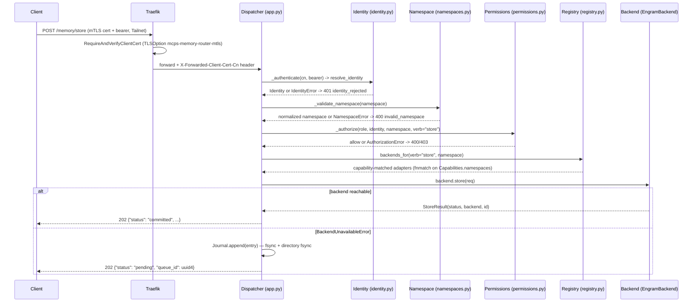
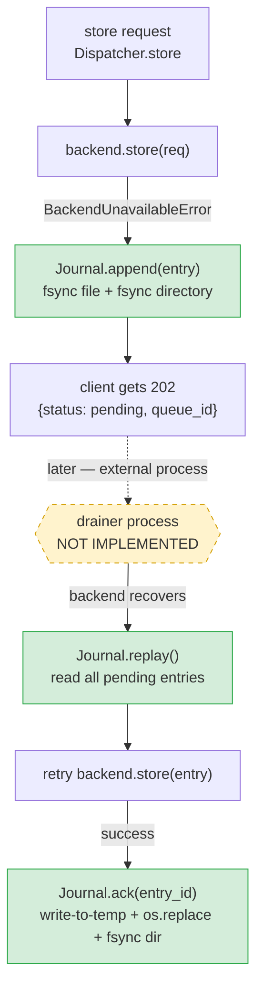

# memory-router

`memory-router` is a namespaced, permissioned routing layer that sits in
front of Engram (and, in later phases, other memory backends) so that no
agent talks to a memory backend directly. It centralizes identity
resolution, role-based authorization, namespace validation, and
degraded-backend durability behind one MCP + REST surface, planned as a
third tenant of the `mcps` Kubernetes namespace alongside `engram-cloud`.
It exists because memory access was fragmenting: Engram is the only real
backend today, reachable only per-client via `engram mcp`, with no
namespaces and no per-identity permissions, and five more backends
(Hindsight, Graphiti, Honcho, Cognee, Obsidian) are planned — each with its
own protocol. Without one routing layer, every agent would have to
integrate all six backends itself.

## Status

**Not deployed. No live pods.** `kubectl get deploy -n mcps memory-router`
returns `NotFound`; `kubectl get pods -n mcps` shows only
`engram-cloud-*` and `engram-postgres-*`. This matches every k8s manifest
header (`kubernetes/mcps/memory-router-*.yaml`), which states "NOT YET
APPLIED", and the archive report's blocker section — so this is a
confirmed, currently-true fact, not a stale note carried over from
planning.

Code and tests are complete: Phase 1 (router skeleton + a single Engram
backend adapter) shipped 80/80 passing unit tests and an `sdd-verify` PASS.
What's blocked is applying the manifests to a real cluster, because the
`mcps` namespace's existing resources (from Engram Cloud) are untracked
with undocumented origin/ownership — deploying a third tenant into that
namespace without first resolving who owns it is judged unsafe. This is
an infrastructure/ownership gap, not a defect in the router code.

Deferred (intentionally, not blocked): ConfigMap → PyYAML wiring. The
ConfigMap (`kubernetes/mcps/memory-router-configmap.yaml`) documents the
intended identity→role and role-table shape, but Phase 1 code does not
read it — `permissions.py::IDENTITY_ROLES` and
`app.py::_load_role_map_from_env()` hardcode the equivalent maps.
**Editing the ConfigMap today has zero runtime effect.**

- Numbered spec (Spanish, the detailed narrative): [`specs/014_memory_router.md`](../../specs/014_memory_router.md)
- Archived SDD change (design rationale, threat matrix, open questions): [`openspec/changes/archive/2026-08-19-memory-router/`](../../openspec/changes/archive/2026-08-19-memory-router/) — read `design.md` and `archive-report.md` there for the full story
- Durable capability specs (source of truth for requirements): `openspec/specs/memory-router-interfaces/`, `memory-namespace-routing/`, `memory-backend-adapters/`, `memory-access-control/`

## Quick path

1. Read the source at `hermes-native/memory-router/src/memory_router/` — start with `app.py`'s `Dispatcher` class, then `permissions.py` and `namespaces.py`.
2. Run the tests: `cd /home/pedro/Documentos/Projects/jarvis_project && python3 -m unittest discover -s tests` (verified below).
3. See the intended deployment shape in `kubernetes/mcps/memory-router-*.yaml` — it is not yet applied anywhere (see Status).

## Architecture

Every request — REST or MCP — goes through the exact same `Dispatcher`
pipeline, so both surfaces produce identical routing decisions
(MCP/REST parity is an explicit spec requirement):

```text
client (mTLS cert + bearer, Tailnet)
  -> Traefik Ingress (RequireAndVerifyClientCert, TLSOption mcps-memory-router-mtls)
  -> Dispatcher.store() / .search() / .context()
       1. _authenticate: CN header -> Identity (identity.py)
       2. _validate_namespace: namespace string -> one of 4 fixed roots (namespaces.py)
       3. _authorize: role + identity + namespace-kind + verb -> allow/deny (permissions.py)
       4. Registry.backends_for(verb, namespace): capability-matched adapters (registry.py)
       5. backend.store/search, OR:
            store, backend down  -> Journal.append() -> 202 {"status": "pending"}
            search, backend down -> skip + record {"backend", "reason"} in "unavailable"
  -> EngramBackend -> subprocess `engram mcp --tools=agent` -> engram-cloud.mcps.svc.cluster.local:8080
```

The same pipeline, as a `store` call end to end (the compact table above stays useful as a one-glance reference; this sequence pins down the exact order, ownership, and branch points):



Implementation is pure-stdlib Python 3.11 (`http.server.ThreadingHTTPServer`)
— four Tailnet clients don't justify a new ASGI stack. The router itself is
stateless per request; only the write journal and Engram's own store are
durable.

**Identity resolution** (`identity.py::resolve_identity`): Traefik forwards
the verified client-certificate CN via the `X-Forwarded-Client-Cert-Cn`
header (`app.py::CLIENT_CN_HEADER` — flagged in the code as TBD/unconfirmed
against the live ingress config). The CN is looked up in a router-owned
`cn_to_identity` map, then the request's bearer token is compared against
the identity's expected token with `hmac.compare_digest`. Any missing CN,
unknown CN, missing bearer, or mismatched bearer raises `IdentityError` ->
`DispatchError(401, "identity_rejected", ...)`. Fail-closed throughout.

**Namespace validation** (`namespaces.py::validate_namespace`): rejects
anything falling outside the four fixed roots, plus `..` traversal, `%2f`/
`%2e` encoded traversal, and `*`/`?` wildcards — before any authorization
check runs. Errors become `DispatchError(400, "invalid_namespace", ...)`.

**Authorization** (`permissions.py::authorize`): three checks, all must
pass — (1) the declared `role` is one of the three known roles, (2) that
role is in the calling identity's server-side permitted set
(`IDENTITY_ROLES`), (3) the namespace-kind + verb combination is allowed
by the role table. A caller only *declares which of its permitted roles*
it acts as for a request; it can never self-assert a role outside that
set. Errors are distinguished, not generic: unknown role -> `400
invalid_role`; role not in the identity's permitted set -> `403
role_not_permitted`; namespace+verb denied -> `403 authorization_denied`.

**Registry** (`registry.py`): loads backend adapters via the
`memory_router.backends` Python entry-point group (Phase 1: only
`engram`, wired in `pyproject.toml`). For each request, `backends_for(verb,
namespace)` selects only adapters whose `Capabilities.verbs` include the
verb and whose `Capabilities.namespaces` glob-match the namespace
(`fnmatch`). Adding backend #2 means: new package + entry point + config
row, no router code change.

**`search` hierarchical fallback** (`Dispatcher._fallback_chain`, used only
by `search`, never by `store`):

| Declared namespace | Fallback chain |
|---|---|
| `/projects/{n}` | `/projects/{n}` → `/agents/{caller-identity}` → `/global` |
| `/agents/{n}` | `/agents/{n}` → `/global` |
| `/global`, `/user/master` | no fallback (already terminal) |

Each fallback step re-checks the role's permission for that namespace; a
disallowed fallback step is silently skipped (not an error) — only the
*declared* namespace fails loudly if disallowed. The chain stops at the
first candidate that produces hits.

`context()` (`GET /agents/{name}/context`, `GET /projects/{name}/context`)
goes through the identical identity → namespace → permission pipeline,
authorizing the `"search"` verb (it's read-only), but does **not** walk
the fallback chain — it's scoped strictly to the one requested namespace.

`reflect()` is a Phase 1 placeholder: after authenticating, it immediately
raises `DispatchError(501, "not_implemented", ...)` with no namespace
check, no permission check, no backend call. Product decision: Engram has
no "reflection/lesson" concept; real semantics land with the Hindsight
backend.

## Configuration

Environment variables read by `app.py::build_default_dispatcher` / `main`:

| Variable | Purpose | Default |
|---|---|---|
| `MEMORY_ROUTER_HOST` | Bind host | `0.0.0.0` |
| `MEMORY_ROUTER_PORT` | Bind port | `8080` |
| `MEMORY_ROUTER_JOURNAL_PATH` | NDJSON durable journal file path | `/data/memory-router/journal.ndjson` |
| `MEMORY_ROUTER_BEARER_<IDENTITY>` | Per-identity bearer token (identity name upper-cased, `-` -> `_`, e.g. `MEMORY_ROUTER_BEARER_PEDRO_CLAUDE_CODE`) | none — empty string fails all auth for that identity |
| `ENGRAM_CLOUD_SERVER` | Engram backend's cluster URL (used by the Engram adapter subprocess env) | `http://engram-cloud.mcps.svc.cluster.local:8080` |
| `ENGRAM_CLOUD_TOKEN` | Engram bearer token, forwarded to the `engram mcp` subprocess | empty |

Read by the MCP stdio shim (`app.py::mcp_main`):

| Variable | Purpose |
|---|---|
| `MEMORY_ROUTER_URL` | Base URL of the REST service the shim calls (default `http://127.0.0.1:8080`) |
| `MEMORY_ROUTER_CLIENT_CN` | CN the shim presents as the `X-Forwarded-Client-Cert-Cn` header |
| `MEMORY_ROUTER_CLIENT_BEARER` | Bearer token the shim sends |

The identity → role map (`cn_to_identity` / `IDENTITY_ROLES`) and the
namespace-root list are currently **hardcoded in Python**, not read from
the ConfigMap. `kubernetes/mcps/memory-router-configmap.yaml` documents
the intended shape (`identity-roles.yaml`, `namespace-roots.yaml`,
`role-table.yaml`) for operators, but changing it has no runtime effect
until the deferred PyYAML wiring lands — mirror any change into
`permissions.py`/`app.py` by hand.

Secrets the Deployment expects to already exist in the `mcps` namespace
(created out-of-band, never committed to the repo):

| Secret | Keys | Used for |
|---|---|---|
| `memory-router-engram-credentials` | `ENGRAM_CLOUD_TOKEN` | Engram backend auth |
| `memory-router-client-bearers` | `pedro-claude-code`, `codex`, `opencode`, `hermes-gateway` | per-identity bearer tokens |
| `memory-router-client-ca` | client CA cert | mTLS client-cert verification (TLSOption) |
| `memory-router-server-tls` | server cert/key | IngressRoute TLS |

## API surface

REST, handled by `make_handler`/`RouterRequestHandler` in `app.py`:

| Route | Method | Auth | Notes |
|---|---|---|---|
| `/memory/store` | POST | cert CN + bearer | body: `role`, `namespace`, `content`, `metadata?`. Returns `202` (`committed` or `pending`). |
| `/memory/search` | POST | cert CN + bearer | body: `role`, `namespace`, `query`. Returns `200`, `{"hits": [...], "unavailable": [...]}`. |
| `/memory/reflect` | POST | cert CN + bearer | always `501 not_implemented` in Phase 1. |
| `/agents/{name}/context` | GET | cert CN + bearer | query param `role`. Non-fallback context read for one agent namespace. |
| `/projects/{name}/context` | GET | cert CN + bearer | same, for one project namespace. |
| `/healthz` | GET | none | liveness/readiness probe; never touches identity/permissions/backends. |

MCP stdio shim (`memory-router-mcp` console script, `app.py::mcp_main`):
reads JSON-RPC `tools/call` requests from stdin, normalizes `memory_store`
/ `memory_search` / `memory_reflect` tool calls into the same request
shapes as the REST body parsers (`_parse_store_body`, `_parse_search_body`),
and calls the REST service over HTTP via `RestClient` — so an MCP call and
a REST call for the same input always make the same routing decision.

## Namespaces and permissions

Four fixed namespace roots — no others are ever accepted
(`namespaces.py::NamespaceRoot`): `/global`, `/user/master`,
`/projects/{name}`, `/agents/{name}`. The caller must declare the
namespace explicitly on every request; the router never infers it from
identity or content.

Three roles, no others recognized (`permissions.py::ROLES`): `coder`,
`scientist`, `jarvis`.

Identity → permitted role(s) (`IDENTITY_ROLES`, server-side only — a
caller can only *act as* one of its own permitted roles, never assert a
different one):

| Identity | Permitted role(s) |
|---|---|
| `pedro-claude-code` | `coder` |
| `codex` | `coder` |
| `opencode` | `coder`, `scientist` |
| `hermes-gateway` | `jarvis` |

Role × namespace-kind × verb table (`_ROLE_TABLE`; anything absent is
denied):

| Role | `/global` | `/user/master` | `/projects/{n}` | `/agents/{self}` | `/agents/{other}` |
|---|---|---|---|---|---|
| `coder` | search | deny | store+search | store+search | deny |
| `scientist` | store+search | search | search | store+search | deny |
| `jarvis` | store+search | store+search | store+search | store+search | store+search |

Real examples from `tests/test_memory_router_permissions.py`:

- `test_coder_may_only_search_global` — `coder` calling `store` on
  `/global` is denied; `search` on `/global` is allowed.
- `test_coder_denied_other_agent_namespace` — `coder` acting on
  `/agents/<someone-else>` is denied for both verbs (`agents_other` has no
  allowed verbs for any role except `jarvis`).
- `test_scientist_may_only_search_projects` — `scientist` can `search`
  `/projects/{n}` but not `store` there.
- `test_jarvis_full_access_except_admin` — `jarvis` gets store+search on
  every namespace kind including other agents' namespaces; there is no
  `admin/*` kind in the current table at all (any such namespace fails
  namespace validation before authorization is even reached).
- `test_role_outside_clients_permitted_set_rejected` — `codex` (permitted
  only `coder`) declaring `role="jarvis"` is rejected even though
  `jarvis` is a globally valid role.
- `test_identity_roles_mapping_is_server_side` — the role map lives only
  in router config, never accepted as caller input.

## Degraded-backend behavior

`journal.py::Journal` is an append-only, `fsync`'d NDJSON write queue used
only when `store` hits an unavailable backend. `Dispatcher.store`:

1. Calls the selected backend's `.store(req)`.
2. If it raises `BackendUnavailableError`, calls `Journal.append(...)` and
   returns `{"status": "pending", "queue_id": <uuid4>}` — never a
   compromised `200`, never a generic `5xx`, and the write is never
   dropped.

`Journal.append` writes one JSON line, flushes, `os.fsync`s the file
handle, then `os.fsync`s the containing directory too — durable against a
crash immediately after the write returns. `Journal.replay()` reads all
entries back (a truncated trailing line from a mid-write crash is
tolerated and simply stops the read there, without losing prior committed
entries); `Journal.ack(entry_id)` removes one entry via write-to-temp-file
+ `os.replace` (atomic rename) + directory fsync, for a drainer process to
call once a backend confirms the deferred write. Verified by
`tests/test_memory_router_journal.py`, including a test that reopens the
journal file in a fresh `Journal` instance and confirms entries survive.



**Implemented today** (green nodes above, tested by
`tests/test_memory_router_journal.py`): `Journal.append`, `Journal.replay`,
`Journal.ack` — the append/read/acknowledge primitives, each durable
against a crash immediately after it returns. **Not implemented**
(dashed/amber node): an actual automated drainer process that calls
`replay()` and `ack()` on a schedule or on backend-recovery signal. Neither
`app.py` nor `journal.py` contains any such loop, poller, or scheduled job
— the docstring on `journal.py::Journal` and this section's prose both
describe the drainer only as future work ("for a drainer process to call
once a backend confirms the deferred write"). Today, a pending entry stays
in the journal until something external reads it; there is no code path in
this repo that drains it automatically.

**Why `replicas: 1` + `strategy: Recreate` is a hard requirement, not a
style choice:** the journal is a single-writer append-only file on one
PVC (`kubernetes/mcps/memory-router-pvc.yaml`, `ReadWriteOnce`,
`local-path`, 1Gi). Two concurrent writers appending to the same file
without coordination can interleave writes and corrupt the NDJSON stream.
`Recreate` guarantees the old pod fully terminates (releasing the PVC and
closing its file handle) before the new pod starts and reopens the
journal — a rolling update would briefly run two pods against the same
file. This is called out explicitly in the deployment manifest's inline
comment, referencing `design.md`'s "Router statefulness"/"Queue mechanism"
sections.

`search` degradation is different: `Dispatcher.search` and
`Dispatcher.context` catch `BackendUnavailableError` per backend, per
fallback-chain candidate, and append `{"backend": exc.backend, "reason":
exc.reason}` to an `unavailable` list instead of failing the whole
request — the response is still `200` with whatever hits *did* come back
from healthy backends, plus that `unavailable` marker list so the caller
knows the result set may be incomplete.

## Running it locally / tests

Verified working from repo root, no install needed (the test files insert
`hermes-native/memory-router/src` onto `sys.path` themselves):

```bash
cd /home/pedro/Documentos/Projects/jarvis_project
python3 -m unittest discover -s tests
```

Result when run: **`Ran 90 tests in 5.016s — OK`**.

That command runs the *entire* repo-root test suite, not just
memory-router's. `tests/test_memory_router_*.py` (8 files, 80 tests —
`contracts`, `identity`, `namespaces`, `permissions`, `journal`,
`registry`, `engram_adapter`, `app`) are memory-router's own tests.
`tests/test_shared_mcp_contracts.py` (10 tests) is an **unrelated** suite
living in the same `tests/` directory — it covers shared MCP tenant
contracts (CI repo allow-lists, CodeGraph adapter isolation, onboarding
fail-closed behavior, etc.), not memory-router specifically. Don't
conflate the two when reading suite output.

To run only memory-router's own tests:

```bash
python3 -m unittest discover -s tests -p "test_memory_router_*.py"
# Ran 80 tests in 5.016s — OK
```

## Deploying

Not yet possible against the live cluster — see **Status**. When the
Engram Cloud manifest-ownership prerequisite is resolved, the intended
sequence is:

1. Confirm/create the four secrets listed in **Configuration** in the
   `mcps` namespace (never commit the CA private key or tokens to the repo).
2. Resolve the ingress host placeholder in
   `kubernetes/mcps/memory-router-ingress.yaml`
   (`memory-router.TAILNET_MAGICDNS_PLACEHOLDER`) to the cluster's real
   Tailnet MagicDNS name.
3. Build/push a real `memory-router:0.1.0` image — the Deployment
   currently references a placeholder image with no registry or build
   pipeline behind it.
4. `kubectl apply -k kubernetes/mcps/` (or apply the six
   `memory-router-*.yaml` files individually — there's no kustomization
   file yet, this is the intended shape).
5. Verify: `kubectl get pods -n mcps -l app=memory-router`, then
   `kubectl exec` or port-forward and hit `GET /healthz` (unauthenticated,
   `200 {"status": "ok"}`).

Manifest facts worth knowing before touching this:

- Resources: `Deployment`, `Service` (ClusterIP, port 8080), `ConfigMap`
  (`memory-router-config`, documentation-only today), `PersistentVolumeClaim`
  (`memory-router-journal`, 1Gi, `local-path`, RWO), `IngressRoute`
  (`memory-router-tailnet`, Traefik, `websecure` entrypoint), `TLSOption`
  (`mcps-memory-router-mtls`, TLS 1.2+, `RequireAndVerifyClientCert`).
- Namespace: `mcps` for everything.
- Security context: `runAsNonRoot: true` with an **explicit numeric**
  `runAsUser: 10001` / `runAsGroup: 10001` / `fsGroup: 10001` — the
  manifest comment cites a real bug from spec 011 §4: `runAsNonRoot`
  without a numeric `runAsUser` makes the kubelet reject the container
  ("cannot verify user is non-root"). Also: `seccompProfile: RuntimeDefault`,
  `allowPrivilegeEscalation: false`, `readOnlyRootFilesystem: true`,
  `capabilities.drop: ["ALL"]`, `automountServiceAccountToken: false`.
- Resource requests/limits: 128Mi/100m requests, 512Mi/500m limits.
- Probes: `readinessProbe` and `livenessProbe` both hit `GET /healthz` on
  port 8080 (readiness: 5s initial delay / 5s period; liveness: 15s/15s).

## Common modifications

**Adding a new role:**
1. Add the role string to `permissions.py::ROLES`.
2. Add a row for it to `_ROLE_TABLE` covering every namespace kind
   (`global`, `user_master`, `projects`, `agents_self`, `agents_other`) —
   anything you omit is denied by default, which may be what you want.
3. Grant it to at least one identity in `IDENTITY_ROLES`, or it's
   unreachable.
4. Update the documentation copy in
   `kubernetes/mcps/memory-router-configmap.yaml`'s `role-table.yaml`
   (documentation only — has no runtime effect until PyYAML wiring lands).
5. Add tests in `tests/test_memory_router_permissions.py` mirroring the
   existing per-role test pattern (e.g. `test_jarvis_full_access_except_admin`).

**Adding a new namespace root pattern:**
1. Extend `namespaces.py::NamespaceRoot` and the validation branches in
   `validate_namespace`.
2. Add a `_namespace_kind` branch in `permissions.py` so the new root maps
   to a permission-table kind (or reuses an existing one).
3. Extend `_ROLE_TABLE` rows for the new kind, and `Dispatcher._fallback_chain`
   in `app.py` if the new root should participate in hierarchical search
   fallback.
4. Check `EngramBackend.capabilities().namespaces` glob patterns
   (`backends/engram.py`) — a new root also needs a matching glob there or
   the registry will never select the backend for it.
5. Add tests in `tests/test_memory_router_namespaces.py` and
   `tests/test_memory_router_permissions.py`.

**Onboarding a new client identity:**
1. Add its CN → identity-name mapping in
   `app.py::_load_role_map_from_env`'s `cn_to_identity` dict.
2. Add it to `permissions.py::IDENTITY_ROLES` with its permitted role(s).
3. Add a `MEMORY_ROUTER_BEARER_<NAME>` entry (env var name = identity name
   upper-cased, `-` → `_`) to the Deployment env and to the
   `memory-router-client-bearers` Secret.
4. Issue it a client certificate signed by `memory-router-client-ca` with
   CN matching what you added in step 1.
5. Add tests in `tests/test_memory_router_identity.py` /
   `tests/test_memory_router_permissions.py`.

## Troubleshooting

| Symptom | Likely cause | Where to look |
|---|---|---|
| `401 identity_rejected` | Missing/unknown CN, missing bearer, or bearer mismatch | `identity.py::resolve_identity`; check Traefik is actually forwarding `X-Forwarded-Client-Cert-Cn` (header name is unconfirmed against the real ingress — `app.py::CLIENT_CN_HEADER`) |
| `400 invalid_namespace` | Namespace missing, not absolute, traversal/wildcard chars, or outside the 4 fixed roots | `namespaces.py::validate_namespace` |
| `400 invalid_role` | Declared role isn't one of `coder`/`scientist`/`jarvis` | `permissions.py::authorize` |
| `403 role_not_permitted` | Declared role is valid globally but not in this identity's permitted set | `permissions.py::IDENTITY_ROLES` |
| `403 authorization_denied` | Role is valid and permitted for the identity, but the namespace-kind+verb combo isn't in `_ROLE_TABLE` | `permissions.py::_ROLE_TABLE` |
| `store` returns `202 {"status": "pending", ...}` instead of `"committed"` | Engram (or whichever backend) raised `BackendUnavailableError` — subprocess crashed, produced no output, or returned malformed JSON | `backends/engram.py::_StdioRpcClient`; check the journal at `MEMORY_ROUTER_JOURNAL_PATH` for the queued entry, and Engram's own health (spec 011) |
| `search`/`context` returns fewer hits than expected, with a populated `unavailable` list | One or more backends were down for that request; the response is still `200` — this is by design, not a bug | `journal.py` is not involved here (search never queues); check the `reason` field per backend in `unavailable` |
| `501 not_implemented` on `/memory/reflect` | Expected — Phase 1 placeholder, not implemented until the Hindsight backend lands | `app.py::Dispatcher.reflect` |
| Container fails to start with "cannot verify user is non-root" | `runAsNonRoot: true` without a numeric `runAsUser` (a real bug hit in spec 011 §4) | `kubernetes/mcps/memory-router-deployment.yaml` already sets `runAsUser: 10001` explicitly — don't remove it |
| Journal file looks truncated after a crash | Expected recovery behavior: `Journal._read()` stops at the first line that fails to parse as JSON, discarding only the incomplete trailing line, never previously committed entries | `journal.py::Journal._read` |
| Two pods briefly both writing the journal during a rollout | `strategy: Recreate` was removed/overridden — this must never happen with a single-writer append-only journal on one PVC | `kubernetes/mcps/memory-router-deployment.yaml` |

## See also

- [`docs/architecture/README.md`](../architecture/README.md) — system-wide map, the `mcps` namespace, and the memory-router entry's "not yet deployed" callout
- [`docs/glossary.md`](../glossary.md) — see **journal (memory-router)**, **MCP**, **namespace (Kubernetes)**
- [`specs/014_memory_router.md`](../../specs/014_memory_router.md) — the numbered SDD spec (Spanish), full architecture/threat-matrix narrative
- `openspec/specs/memory-router-interfaces/spec.md`, `memory-namespace-routing/spec.md`, `memory-backend-adapters/spec.md`, `memory-access-control/spec.md` — durable capability specs, source of truth for requirements
- [`openspec/changes/archive/2026-08-19-memory-router/`](../../openspec/changes/archive/2026-08-19-memory-router/) — archived SDD change: `proposal.md`, `design.md` (architecture decisions, open questions), `archive-report.md` (what actually shipped), `tasks.md`
- `specs/011_engram_cloud_centralized.md` — Engram Cloud itself, the only real backend today and the access path memory-router's Engram adapter reuses
