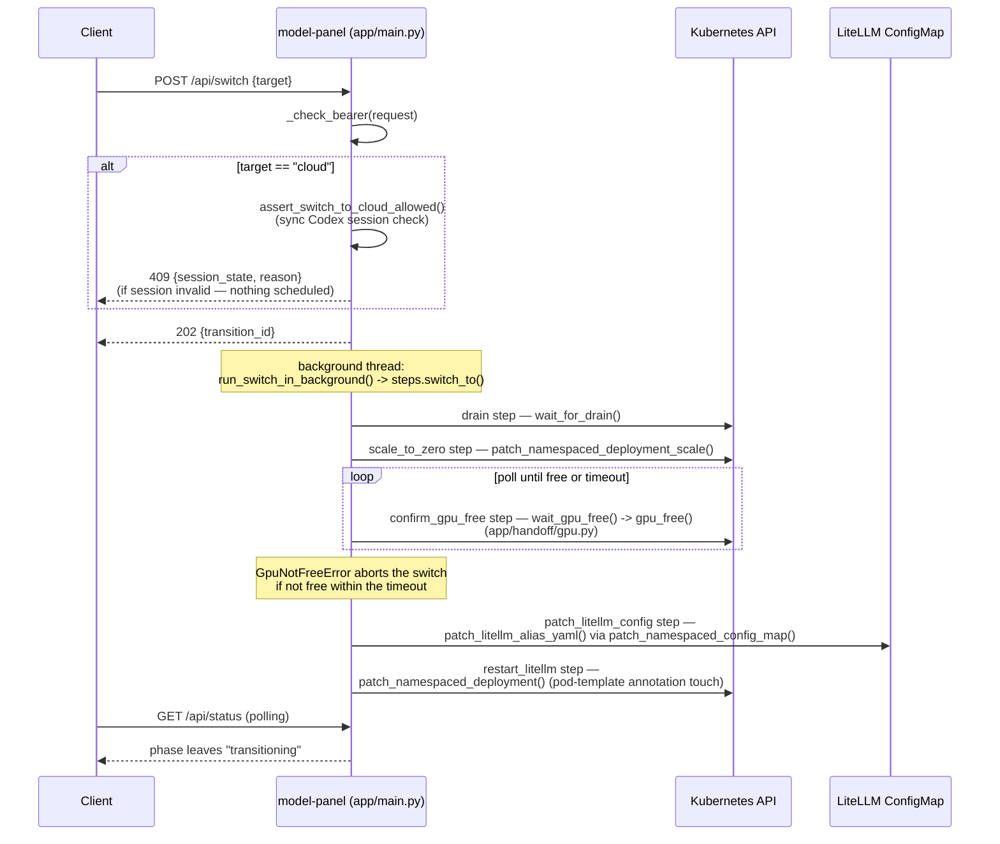
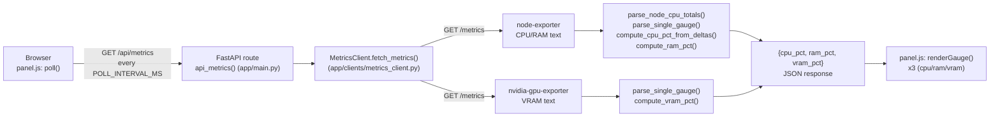

# model-panel

A FastAPI web app that replaces a ~15-step manual `kubectl`/bash runbook for
freeing the machine's single GPU with a one-click Local↔Cloud toggle, plus a
live view of CPU/RAM/VRAM usage. Runs as a Deployment in namespace `llms`.

## Quick path

1. Read [How GPU handoff works](#how-gpu-handoff-works) — the one concept
   that explains everything else in this doc.
2. `cd kubernetes/model-panel && python3 -m venv .venv && .venv/bin/pip
   install -r requirements.txt pytest pyyaml && .venv/bin/python -m pytest`
   — confirms your checkout is healthy before you touch anything.
3. `kubectl apply -k kubernetes/model-panel` to deploy; see
   [Deploying](#deploying) for the secrets it needs first.
4. Open the panel (`https://model-panel.lan`, mTLS + bearer token) and watch
   the mode badge and the three gauges update every 2 seconds.

## API surface

Every route except `/healthz` requires `Authorization: Bearer
<MODEL_PANEL_AUTH_TOKEN>`. An unset token fails closed (`503`), never open.

| Route | Method | Does |
|---|---|---|
| `/healthz` | GET | Liveness, no auth |
| `/api/status` | GET | Current mode (`local`/`cloud`), active profile, Codex session state, switch phase, drift info |
| `/api/metrics` | GET | `{cpu_pct, ram_pct, vram_pct}`, each `float \| null` |
| `/api/switch` | POST | Toggle Local↔Cloud — `{"target": "cloud"\|"local"}` |
| `/api/profile` | POST | Switch local profile without leaving Local — `{"profile": "daily"\|"large"}` |
| `/api/repair` | POST | Self-heal a `degraded` state after a failed switch |
| `/` | GET | The single-page UI |

`POST /api/switch` is fail-closed and asynchronous: it checks the Codex
session's validity **synchronously** before returning anything (a switch to
`cloud` with an invalid session returns `409 {session_state, reason}`
immediately, nothing gets scheduled). Once accepted, it returns `202` and
runs the actual multi-minute drain/scale/reconfigure sequence on a
background thread, so `GET /api/status` keeps polling responsively and the
UI disables the toggle button while `phase == "transitioning"`.

## How GPU handoff works

The machine has exactly **one** physical GPU. "Handoff" means moving it
deterministically from one consumer to another — local model serving, or
freeing it entirely for something else (Cloud mode routes through
`codex-shim` instead, using no local GPU at all):



1. **Drain** — stop sending new traffic to the local model.
2. **Scale to zero** — the currently-active local Deployment
   (`llama-router`, or whichever `vllm*`/`llama-server*` is active).
3. **Confirm the GPU is actually free** (`app/handoff/gpu.py`,
   `gpu_free()`) — checks the Kubernetes API for any non-terminal pod still
   requesting `nvidia.com/gpu`, rather than trusting "scaled to zero" alone
   (a pod can be `Running` with a `deletionTimestamp` set and still hold the
   GPU until it's actually gone). If the GPU doesn't confirm free within a
   timeout, the switch **aborts** — it never forces itself through.
4. **Rewrite LiteLLM's alias** — patch the `qwen3` (and Cloud-mode's
   dedicated `cloud`) alias in LiteLLM's ConfigMap to point `api_base` at
   either `llama-router` or `codex-shim`.
5. **Restart LiteLLM** — patching the ConfigMap alone isn't enough; LiteLLM
   caches its `model_list` in memory, so the panel also patches the
   Deployment's pod-template annotations to force a rollout (this was a bug
   found during live verification — restart is not optional).

Returning to Local always re-defaults to the **daily** profile, never
resumes whatever profile was active before switching away.

### Drift and self-heal

Something else (a routine `kubectl apply -f litellm-config.yaml`, a manual
`kubectl` command) can silently revert the alias or scale a Deployment back
up outside the panel's control. `GET /api/status` re-reads live cluster
state every poll and reports `drift`/`alias_drift`; if it detects the
`qwen3` alias pointing somewhere other than what the recorded `mode` says
it should, it debounces (max once per 30s) and automatically re-patches it
in the background — this is `maybe_self_heal_alias_drift` in `app/main.py`,
not something you need to trigger manually.

## Real-time metrics gauges

CPU/RAM/VRAM are scraped directly from two lightweight exporters — no
Prometheus server, this cluster is one node and three numbers don't need
one:

| Exporter | DaemonSet | Reads |
|---|---|---|
| `node-exporter` | `node-exporter.yaml` | `/proc`, `/sys`, `/` (read-only `hostPath`, **no** `hostNetwork`) |
| `nvidia-gpu-exporter` | `gpu-exporter.yaml` | `nvidia-smi` via `runtimeClassName: nvidia` + `NVIDIA_VISIBLE_DEVICES=all` |



**The GPU exporter deliberately never requests the `nvidia.com/gpu`
Kubernetes resource.** That resource is the same discrete unit the entire
handoff mechanism above manages — if the exporter requested it, it would
permanently claim the node's only GPU and every other check in
`app/handoff/gpu.py` would see it as busy forever. GPU visibility instead
comes from the runtime class + env vars, the exporter's own
upstream-documented way to get device access without reserving hardware.
Both DaemonSets carry an explicit toleration for the node's
`nvidia.com/gpu:NoSchedule` taint — that taint is **dynamic** (present or
absent depending on driver/device-plugin state), so the toleration matters
even when the taint looks absent right now.

`app/clients/metrics_client.py`'s `MetricsClient` polls both exporters'
`/metrics` text on every `GET /api/metrics` call. CPU % needs a *delta*
between two scrapes (it's a cumulative counter, not an instant reading) —
the client keeps the previous sample in memory (guarded by a
`threading.Lock`, since this is a sync FastAPI route running in a
threadpool and can be called concurrently), so **the very first poll after
a pod restart always returns `cpu_pct: null`** — this is by design, not a
bug; the frontend already renders `null` as a distinct gray "unknown"
state. RAM and VRAM have no such warm-up — they're instant gauge reads.

Full design rationale, including the two things the original design sketch
got wrong before implementation corrected them (hostPath device mounts
instead of the runtime class, and `hostNetwork: true` on node-exporter):
`docs/superpowers/specs/2026-08-18-realtime-server-metrics-design.md`.

## Configuration

| Env var | Default | Does |
|---|---|---|
| `MODEL_PANEL_AUTH_TOKEN` | *(required, from Secret `model-panel-auth`)* | Bearer token for every `/api/*` route |
| `MODEL_PANEL_NAMESPACE` | `llms` | Namespace the handoff logic operates in |
| `MODEL_PANEL_STATE_CONFIGMAP` | `model-panel-state` | Where mode/phase state persists across pod restarts |
| `CODEX_SHIM_BASE_URL` | `http://codex-shim.llms.svc.cluster.local:8080/v1` | Cloud target |
| `LLAMA_ROUTER_BASE_URL` | `http://llama-router.llms.svc.cluster.local:8080/v1` | Local target |
| `NODE_EXPORTER_BASE_URL` | `http://node-exporter.llms.svc.cluster.local:9100` | CPU/RAM source |
| `GPU_EXPORTER_BASE_URL` | `http://nvidia-gpu-exporter.llms.svc.cluster.local:9835` | VRAM source |

The exporter URLs are also hardcoded as `DEFAULT_*` constants in
`metrics_client.py` — the env vars in `deployment.yaml` are redundant with
those defaults at runtime, kept for documentation/override purposes, matching
the pattern already used for `CODEX_SHIM_BASE_URL`/`LLAMA_ROUTER_BASE_URL`.

## Deploying

**Secrets required first** (never committed):

```bash
kubectl -n llms create secret generic model-panel-auth \
  --from-literal=bearer="$(openssl rand -hex 32)"
```

Then:

```bash
kubectl apply -k kubernetes/model-panel
kubectl -n llms rollout status daemonset/node-exporter
kubectl -n llms rollout status daemonset/nvidia-gpu-exporter
kubectl -n llms rollout status deployment/model-panel
```

**If you changed application code**, the Deployment's `image:
model-panel:local` with `imagePullPolicy: IfNotPresent` means a plain
`kubectl apply` will keep running whatever image is already cached in the
node's containerd — you must rebuild and reimport it first:

```bash
cd kubernetes/model-panel
docker build -t model-panel:local .
docker save model-panel:local | sudo k3s ctr images import -
kubectl -n llms rollout restart deployment/model-panel
```

`k3s ctr` talks to a root-owned containerd socket
(`/run/k3s/containerd/containerd.sock`) — the import step needs `sudo`, and
that sudo session does **not** carry across separate shells/terminals (each
needs its own auth), which matters if you're scripting this from a
different process than your interactive shell.

## Running tests

```bash
cd kubernetes/model-panel
python3 -m venv .venv
.venv/bin/pip install -r requirements.txt pytest pyyaml
.venv/bin/python -m pytest -v
```

~100 tests: the handoff state machine, drain, GPU-free checks, the
codex-shim/llama-router clients, alias drift/auto-heal, the metrics
client/API, and manifest sanity checks (`test_rbac_manifest.py`,
`test_node_exporter_manifest.py`, `test_gpu_exporter_manifest.py` — these
parse the actual YAML files and assert on real content, e.g. "no
`nvidia.com/gpu` resource request anywhere in the GPU exporter manifest,"
so a regression there fails a unit test, not just a live cluster surprise).

## Common modifications

- **Add a new metric to the gauges** — add a parser function in
  `metrics_client.py` (follow `parse_single_gauge`'s pattern), wire it into
  `fetch_metrics()`'s returned dict, extend `/api/metrics`'s response shape,
  add a gauge element in `index.html` + `renderGauge()` in `panel.js`.
- **Add a new local model target** — extend
  `_default_litellm_params_for`/`_default_litellm_params_for_preset` in
  `app/main.py`, and the corresponding `PROFILE_MODEL_ALIASES` in
  `app/handoff/steps.py`.
- **Change the poll interval** — `POLL_INTERVAL_MS` in `panel.js`;
  everything (status *and* metrics) rides the same interval on purpose, see
  the metrics design doc for why a second timer was deliberately avoided.

## Troubleshooting

- **Gauges stuck on "unknown" after a fresh deploy but the API works when
  you curl it directly** — almost certainly a stale cached `panel.js` in
  the browser (FastAPI's `StaticFiles` doesn't set aggressive
  `Cache-Control`, but browsers can still heuristically cache it). Hard
  refresh (Ctrl+Shift+R) before assuming a backend bug.
- **`POST /api/switch` returns `409 {"error": "transition_in_progress"}`**
  — a switch is already running; wait for `GET /api/status`'s `phase` to
  leave `transitioning`, or the pod restarted mid-switch and the lock is
  stale (restart the pod).
- **`GET /api/metrics` returns all three fields `null`** — both exporters
  are unreachable (DNS or the DaemonSets aren't `Running` — check
  `kubectl -n llms get pods -l app=node-exporter,app=nvidia-gpu-exporter`).
  A single exporter being down only nulls its own fields, not all three —
  if you see all three null, check both, not just one.
- **VRAM gauge reads low even though a model should be loaded** — check
  `kubectl -n llms get deploy llama-router` actually has `READY` replicas;
  a scaled-down/crashed router with no model loaded is indistinguishable
  from "everything's fine, just idle" without checking pod state directly.

## See also

- [Architecture overview](../architecture/README.md#model-panel--gpu-handoff-web-panel-k8s-llms)
- [Glossary: GPU handoff](../glossary.md#gpu-handoff)
- Design doc: `docs/superpowers/specs/2026-08-18-realtime-server-metrics-design.md`
- Implementation plan: `docs/superpowers/plans/2026-08-18-realtime-server-metrics.md`
- Spec **012** (`specs/012_gpu_handoff_web_panel.md`)
- [llama-service, LiteLLM, and codex-shim](llama-service.md) — the two switch targets
